**Room Link : https://tryhackme.com/room/c2carnage**
# Introduction

Welcome to my writeup for the **Carnage** room on TryHackMe. This is a fantastic Medium-difficulty challenge that puts you in the shoes of a SOC analyst. We are given a PCAP file from a confirmed incident where a user, Eric, clicked a malicious link.

My goal was to reconstruct the entire attack chain—from the initial access via phishing to the Command & Control (C2) traffic and final objectives. This room is a great exercise in hunting for **Cobalt Strike** beacons and **Qakbot** malware. Let's dive in!

# Initial Assessment

## Traffic Analysis

I started by opening `carnage.pcap` in Wireshark(you can find it on Desktop in a folder named Analysis).
My first step in any packet analysis is to look at the **Protocol Hierarchy** and **Conversations** to get a high-level overview, but for the specific questions, I jumped straight into filtering.
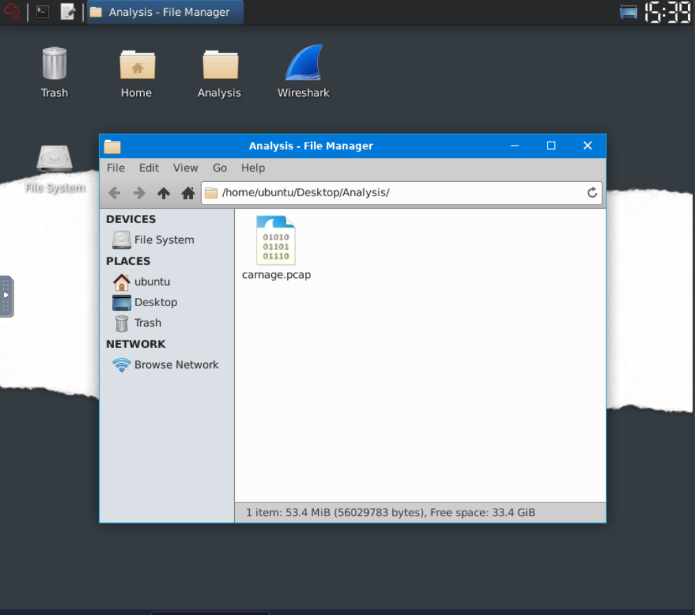
### Phishing & Initial Access

To find the start of the attack, I filtered for HTTP traffic to see what the user was browsing.

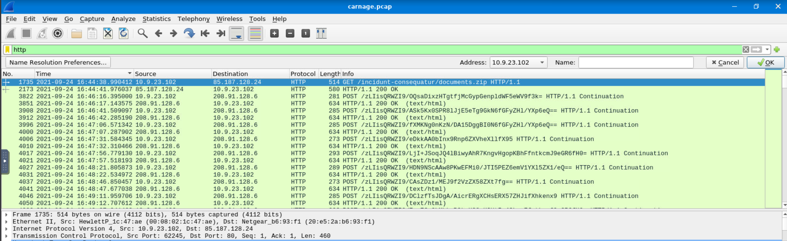
> [!NOTE]
> To see the answer in the right format you should go to **View** -> **Time Display Format** -> **UTC Date and Time of Day** and look for the time of the first packet.

> **Answer 1**
>
>> What was the date and time for the first HTTP connection to the malicious IP? (answer format: yyyy-mm-dd hh:mm:ss)
>
>> `2021-09-24 16:44:38`

Looking closely at this first stream, I noticed the user downloaded a zip file named documents.zip

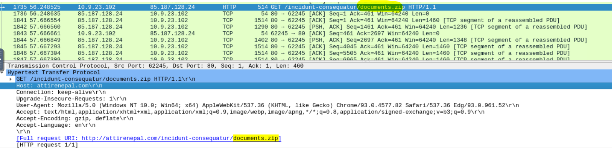

> **Answer 2**
>
>> What is the name of the zip file that was downloaded?
>
>> `documents.zip`

:::tip
Phishing emails often deliver zip files containing malicious Office documents to bypass email filters.
:::

In the same packet where we found documents.zip, we examine the Host header by looking at the Hypertext Transfer Protocol section.
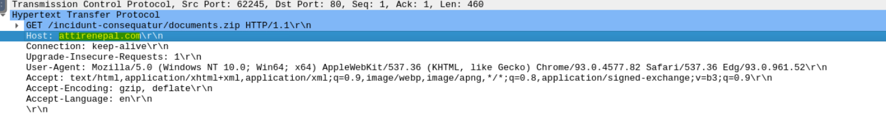

> **Answer 3**
>
>> What was the domain hosting the malicious zip file?
>
>> `attirenepal.com`

So After right clicking on the same packet then **Follow** -> **HTTP Stream** you will find some usefull informations.
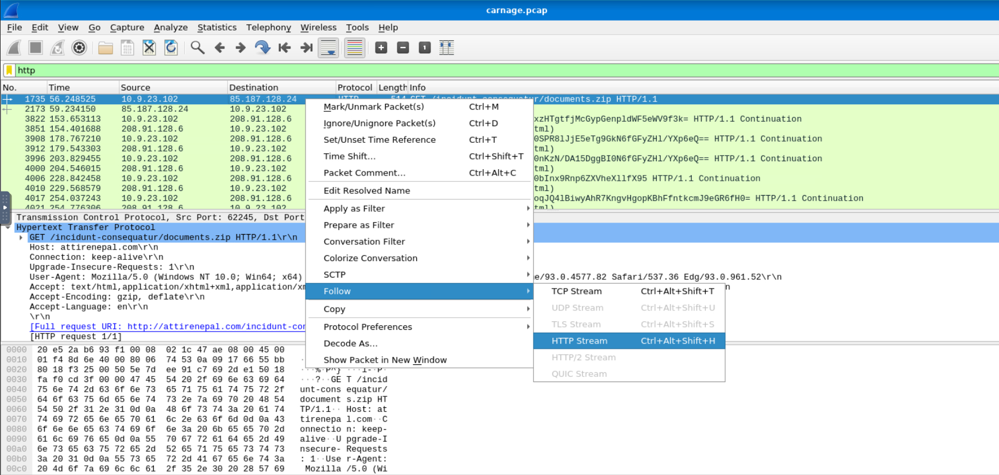

By extracting the zip file (or just looking at the HTTP response headers), I found it contained a file named chart-1530076946.xls. This confirmed my suspicion: an Excel file likely containing malicious macros.
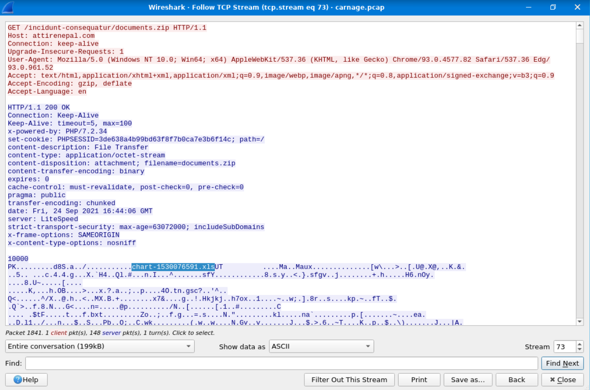

> **Answer4**
>
>> Without downloading the file, what is the name of the file in the zip file?
>
>> `chart-1530076591.xls`

By looking in the exact same packet we can find that the name of the Webserver is found in **server** within the http header.
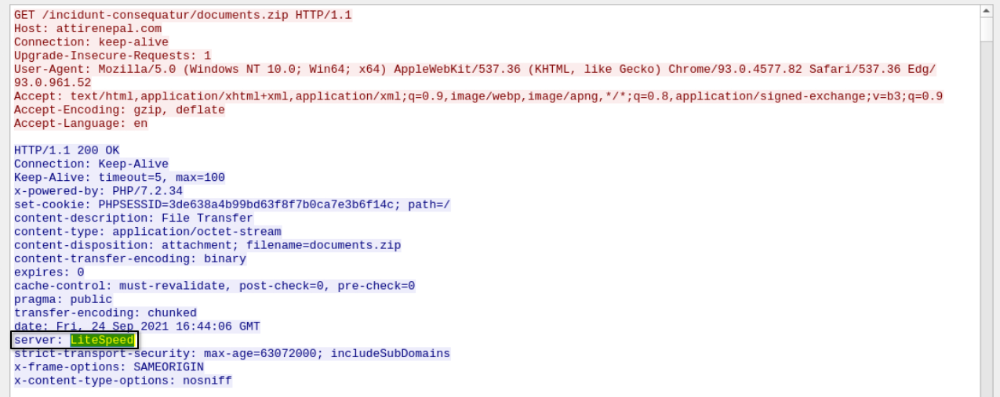

> **Answer 5**
>
>> What is the name of the webserver of the malicious IP from which the zip file was downloaded?
>
>> `LiteSpeed`

To find the version of LiteSpeed webserver we have to look in **x-powered-by** within the same http header we found the previous answer.
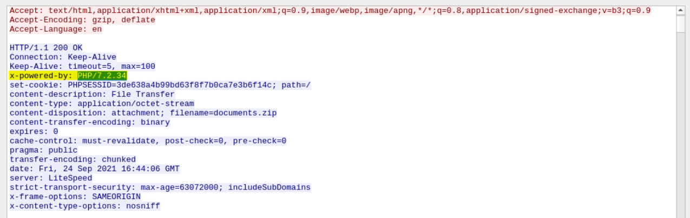

> **Answer 6**
>
>> What is the version of the webserver from the previous question?
>
>> `PHP/7.2.34`

In the next question, the room provides a hint: check HTTPS traffic. Narrow down the timeframe from 16:45:11 to 16:45:30.
So I have filtered out the packets for checking just the https traffic , by using :
```text
tls.handshake.type == 1
```
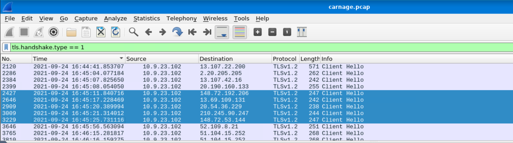

In the specified time I have found 5 packets , when inspecting its information we can see 3 suspicious domains .

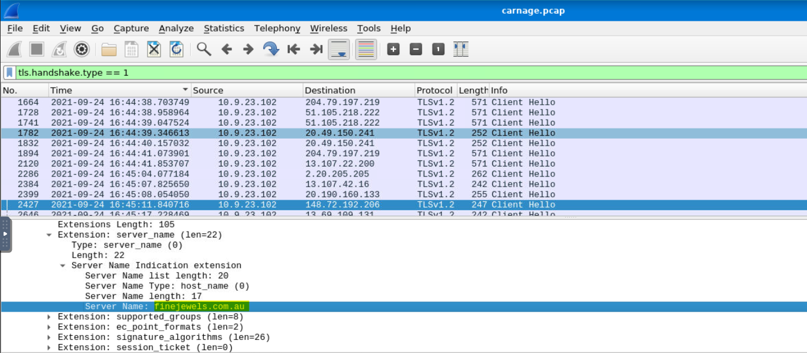

The first one : `finejewels.com.au`

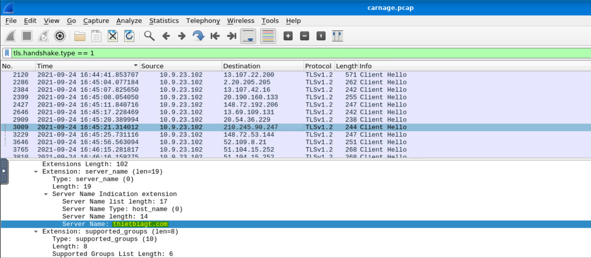

The second one : `thietbiagt.com`

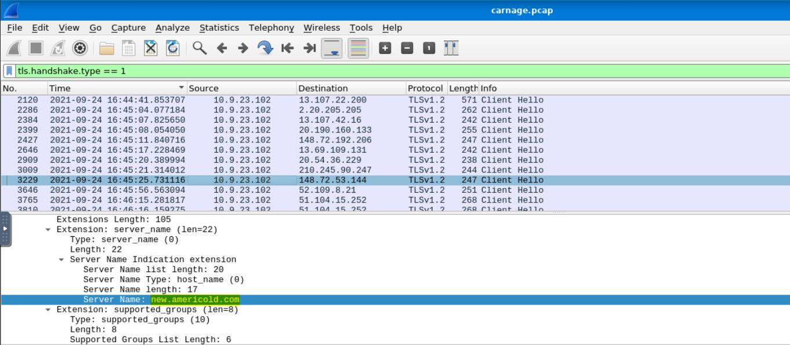

The third one : `new.americold.com`

> **Answer 7**
>
>> Malicious files were downloaded to the victim host from multiple domains. What were the three domains involved with this activity?
>
>> `finejewels.com.au, thietbiagt.com, new.americold.com`

To find the Certificate Authority (CA) related with the first domain which is `finejewels.com.au`
We can inspect the packet of this domain by following http stream.
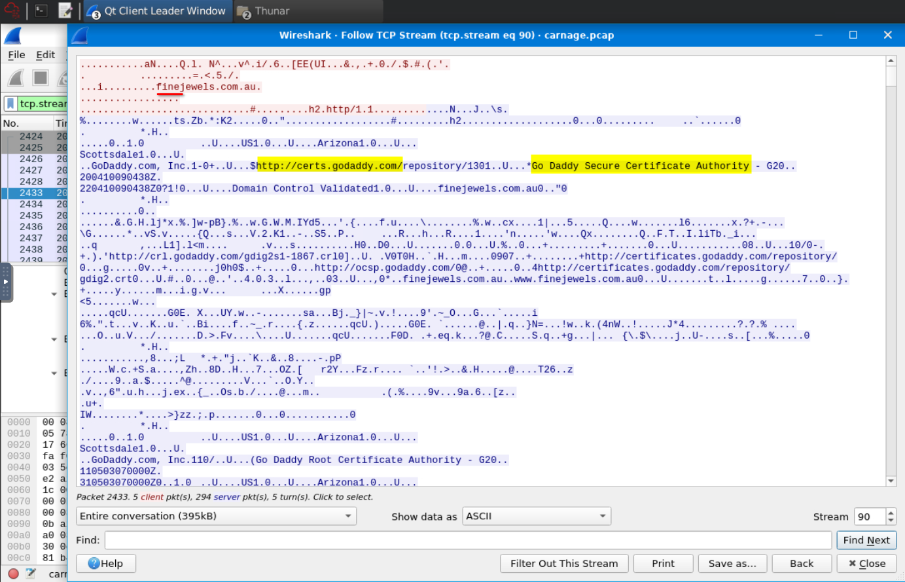

> **Answer 8**
>
>> Which certificate authority issued the SSL certificate to the first domain from the previous question?
>
>> `GoDaddy`

In the main menu bar click **Statistics**, then **Conversations**. And Ordered results by column **Packets**.

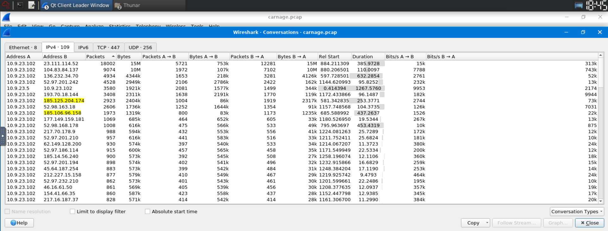

I found two IPs communicating over HTTPS that looked suspicious. Checking them against the **VirusTotal Community** tab confirmed they were Cobalt Strike C2s.

**First IP : 185.125.204.174**
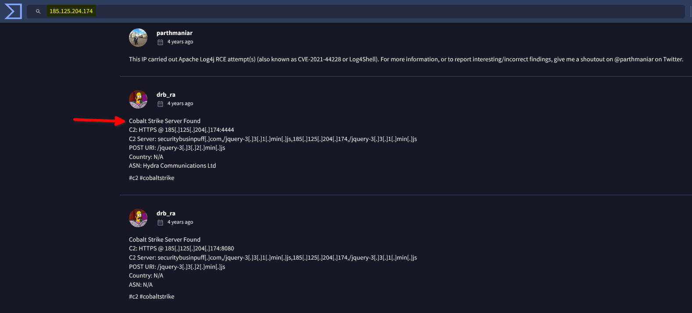

**Second IP : 185.106.96.158**
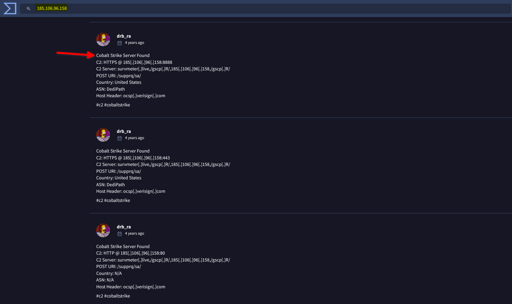

> **Answer 9**
>
>> What are the two IP addresses of the Cobalt Strike servers? Use VirusTotal (the Community tab) to confirm if IPs are identified as Cobalt Strike C2 servers. (answer format: enter the IP addresses in sequential order)
>
>> `185.106.96.158, 185.125.204.174`

I inspected the **Client Hello** packet for the first IP (`185.106.96.158`). The "Server Name" extension (SNI) was set to look like a legitimate service to blend in.
You can do this by : Using filter `ip.addr == 185.106.96.158`. Searching for `GET`. And following its `HTTP Stream`.

You can find the Host for the first Cobalt Strike IP also in VirusTotal in Communauty .

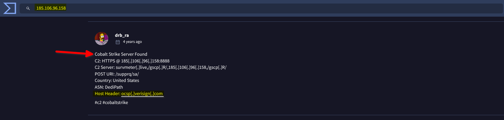

> **Answer 10**
>
>> What is the Host header for the first Cobalt Strike IP address from the previous question?
>
>> `ocsp.verisign.com`

For the next question It was provided with a hint: *Filter out for dns queries.*
SO we can apply filter: `dns.a == 185.106.96.158`

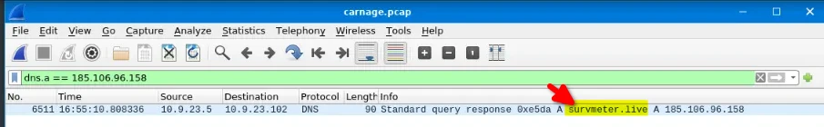

> **Answer 11**
>
>> What is the domain name for the first IP address of the Cobalt Strike server? You may use VirusTotal to confirm if it's the Cobalt Strike server (check the Community tab).
>
>> `survmeter.live`

For the next question we could use *VirusTotal* to find its answer.

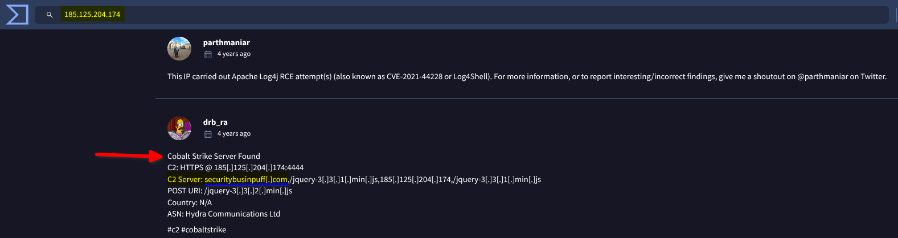

> **Answer 12**
>
>> What is the domain name of the second Cobalt Strike server IP?  You may use VirusTotal to confirm if it's the Cobalt Strike server (check the Community tab).
>
>> `securitybusinpuff.com`

For the next question It was provided with a hint: *Filter POST HTTP traffic.*
So we have to apply filter: `http.request.method = “POST”`.

This was a new idea to me. After the Cobalt Strike beacon, the traffic switched to a new IP (`208.91.128.6`) and became much "noisier" with unencrypted POST requests. I filtered for `http.request.method == "POST"` and saw the domain in the Host header immediately.

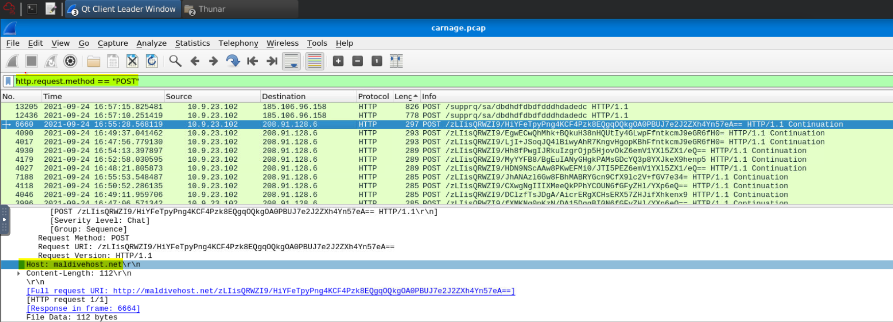

> **Answer 13**
>
>> What is the domain name of the post-infection traffic?
>
>> `maldivehost.net`

Looking at the same packet captured in the previous question. but looking at the URI in the screenshot above, there is a repeating string: `/zLIisQRWZI9/...`. This is the Campaign ID.
So it's clearly the first eleven characters that the victim host sends out to the malicious domain involved in the post-infection traffic.

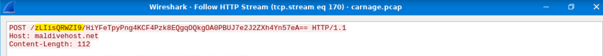

> **Answer 14**
>
>> What are the first eleven characters that the victim host sends out to the malicious domain involved in the post-infection traffic? 
>
>>`zLIisQRWZI9`

In the same packet with the same filter , I looked at length filed we can see the length of the first packet.

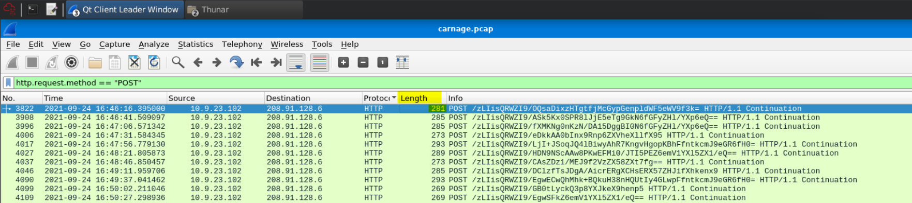

> **Answer 15**
>
>> What was the length for the first packet sent out to the C2 server?
>
>> `281`

I initially tried looking through the packet as normal, but decided to use the **Follow HTTP Stream** feature. This showed the full server response clearly.
The presence of `cPanel` suggests a compromised shared hosting server!


> **Answer 16**
>
>> What was the Server header for the malicious domain from the previous question?
>
>> `Apache/2.4.49 (cPanel) OpenSSL/1.1.1l mod_bwlimited/1.4`

Our victim´s machine is Eric's machine with ip : `10.9.23.102`.

Once again, momentarily stumped. I filtered for `dns` but there were too many packets. I realized malware often uses "ipify" to check its public IP. I refined my filter to `dns.qry.name contains "ipify"`.

You can also filter by `api` instead of `ipify` you should find the answer as well.
```text
dns.qry.name contains "api"
```

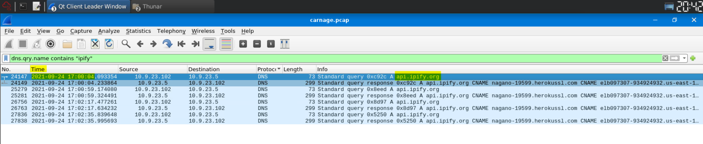

> **Answer 17**
>
>> The malware used an API to check for the IP address of the victim’s machine. What was the date and time when the DNS query for the IP check domain occurred? (answer format: yyyy-mm-dd hh:mm:ss UTC)
>
>> `2021-09-24 17:00:04`

Based on that we can see the info filed related to this packet and we can find the answer of the next question :

>> **Answer 18**
>
>> What was the domain in the DNS query from the previous question?
>
>> `api.ipify.org`

For the next question the first thing that came to mind was `SMTP`, so I filtered down to it. I looked for the first `MAIL FROM` command in the info column.
And i found the answer.

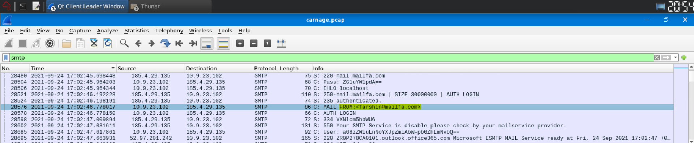

> **Answer 19**
>
>> Looks like there was some malicious spam (malspam) activity going on. What was the first MAIL FROM address observed in the traffic?
>
>> `farshin@mailfa.com`

Oh a nice final simple question to finish. All I had to do was check the packet count at the bottom of the window while the `smtp` filter was active.

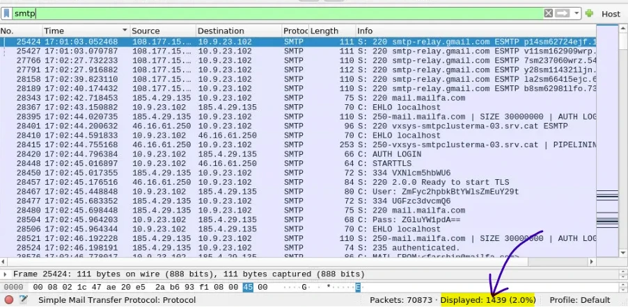

> **Answer 20**
>
>> How many packets were observed for the SMTP traffic?
>
>> `1439`

And here endeth my writeup. I have thoroughly enjoyed this challenge room — but I have also benefitted from writing this article alongside the process. I feel increasingly confident with using Wireshark, though I am not naïve — there’s a lot more to learn!

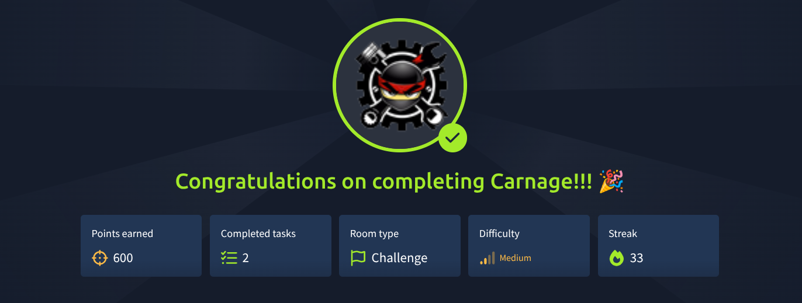

I hope to write more of these for challenge rooms to aid my learning process. If you are in a similar position to me and beginning your cyber journey, I recommend you do so too.


