**Room Link:https://tryhackme.com/room/gallery666**

# Introduction

**Gallery** is a vulnerable Linux machine featuring a custom-built Image Gallery CMS. The investigation focuses on identifying weaknesses in the web application layer, performing credential recovery, and exploiting system-level misconfigurations to achieve full administrative control.

### Objectives
* **Reconnaissance:** Identify open services and software versions.
* **Initial Access:** Exploit the CMS to obtain a low-privileged shell.
* **Privilege Escalation:** Elevate permissions from a standard user to `root`.

# Task 1: Deploy and get a Shell

## 1. Enumeration

I performed a full TCP port scan using Nmap to identify open services.

```bash
nmap -A -T4 -p- 10.67.152.216 -oN nmap-scan
```

**Nmap Results:**

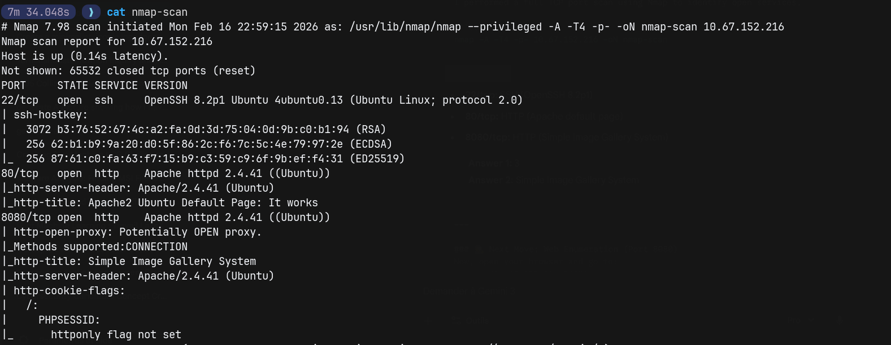

1. **22/tcp: SSH (OpenSSH 8.2p1)**

2. **80/tcp: HTTP (Apache default page)**

3. **8080/tcp: HTTP (Simple Image Gallery System)**

> **Answer 1**
>
>> How many ports are open?
>
>> `3`

After Inspecting the webpage at port `8080` we can clearly see the name of the `CMS` running on that port. 

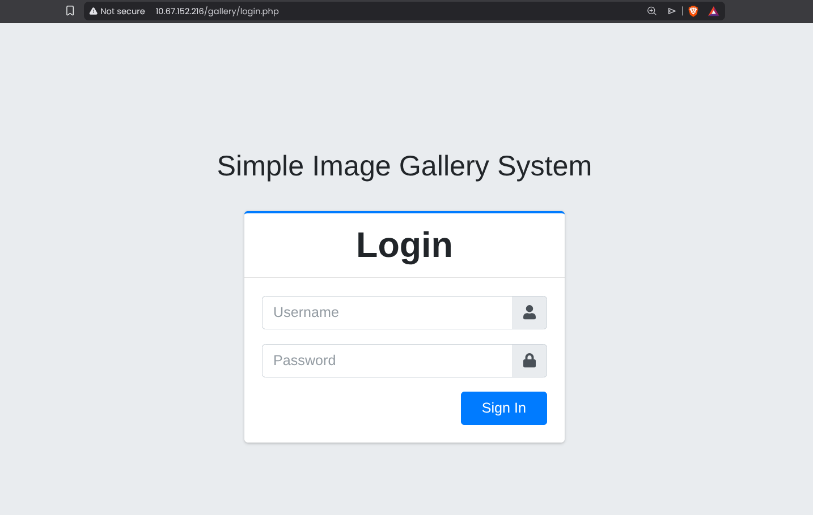

> **Answer 2**
>
>> What's the name of the CMS?
>
>> `Simple Image Gallery`

## 2. Web Exploitation

### Authentication Bypass

I navigated to the login page at http://10.67.152.216:8080/gallery/login.php. Suspecting a lack of input sanitization, I attempted a standard SQL injection payload in the Username field to bypass authentication.

- Payload: **admin' OR 1=1 -- -**

- Password: **password (Any value works)**

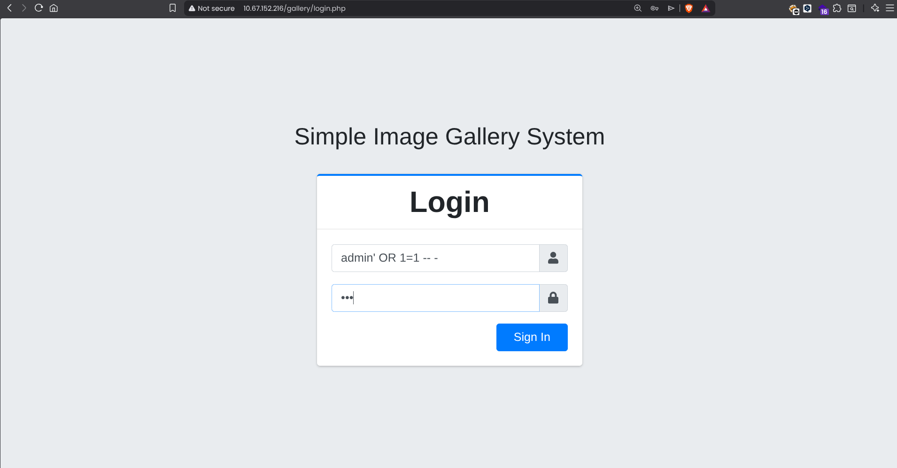

The application accepted the payload, treating the condition 1=1 as true, and logged me in as the administrator.

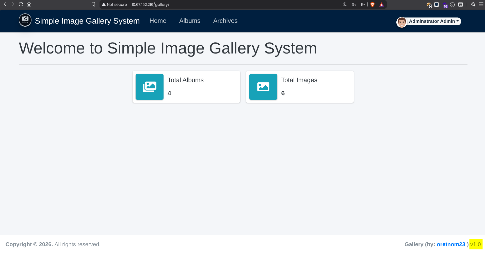

### Database Enumeration (SQL Injection)

Once inside the dashboard, I confirmed the CMS version is 1.0. I searched for known vulnerabilities using `searchsploit`.

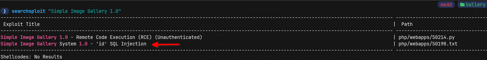

I identified an SQL Injection vulnerability in the id parameter (reading `50198.txt` exploit file). 

### Exploitation (Burp Suite)

To replicate the exploit's Proof of Concept (PoC) exactly, I captured the specific HTTP request triggering the vulnerability.

1. Intercepting the Request:

I configured my browser to proxy traffic through Burp Suite and clicked on an image within an album. I captured the GET request containing the vulnerable id parameter and saved it to a file named test.req.

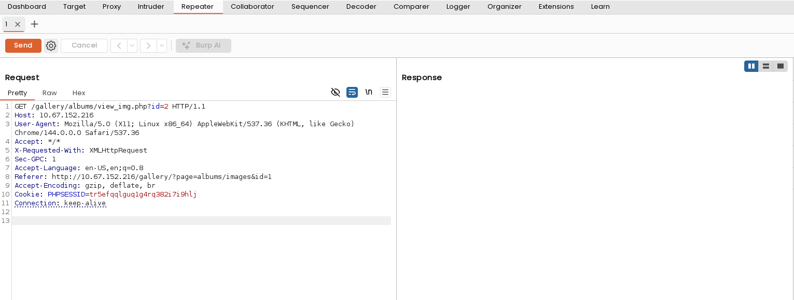

2. Enumerating Databases:

I passed the captured request file to sqlmap to identify the backend databases.

```bash
sqlmap -r test.req --dbs
```
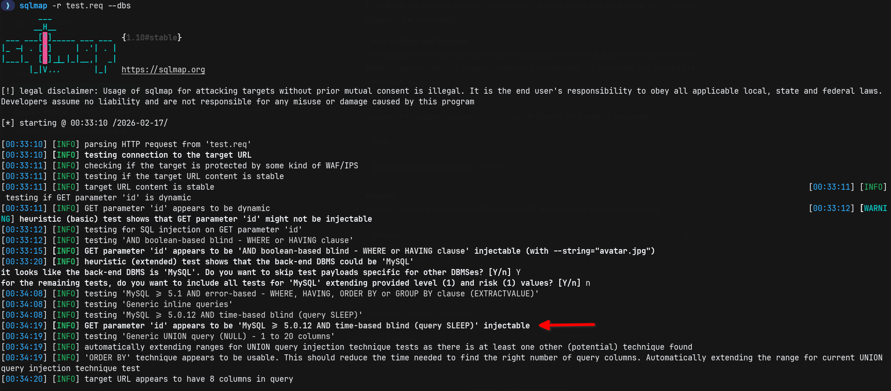

sqlmap identified the backend DBMS as MySQL and listed the available databases.

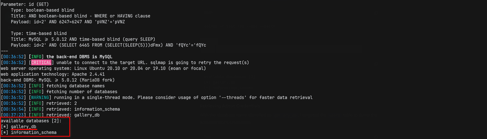

## Retrieving Admin Credentials

With the database name identified as `gallery_db`, I targeted the users table to dump the administrator's credentials.

```bash
sqlmap -r test.req -D gallery_db -T users --dump --batch
```
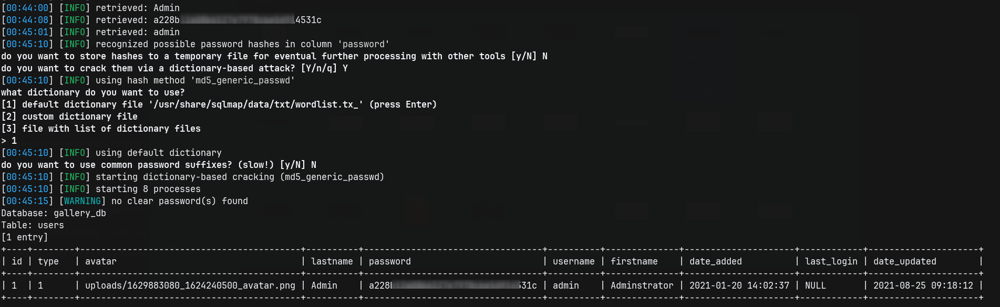

The tool successfully dumped the users table, revealing the administrator's username and password hash.

> **Answer 3**
>
>> What's the hash password of the admin user?
>
>> `a228b12a[REDACTED]be5d914531c`

## 3. Remote Code Execution (RCE)

### File Upload Vulnerability

With administrative access confirmed, I navigated to the "Albums" dashboard. I created a new album and discovered that the image upload feature lacks proper file type validation, allowing for the upload of PHP scripts.

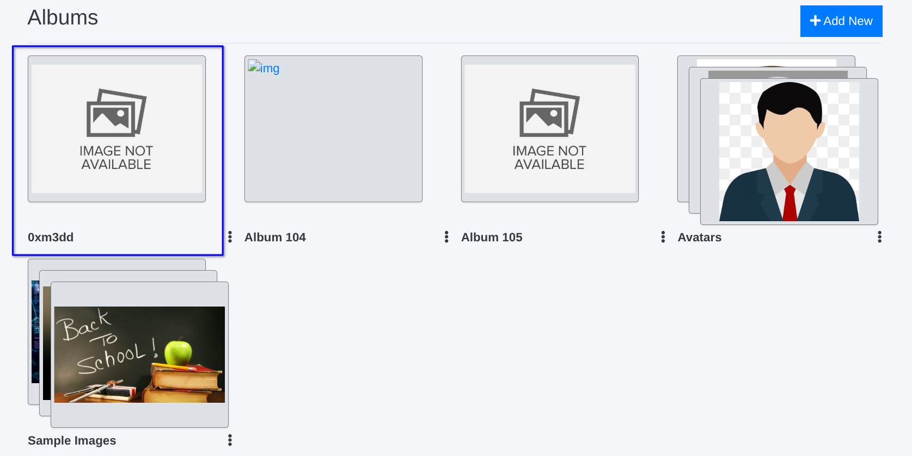

**Exploitation Steps:**

1. **Payload Preparation:** I prepared a standard PHP reverse shell (PentestMonkey), modifying the `$ip` to my VPN address and the `$port` to 1337. You can use your preffered port :)

2. **Upload:** Inside the new album, I uploaded the malicious php_reverse_shell.php file.

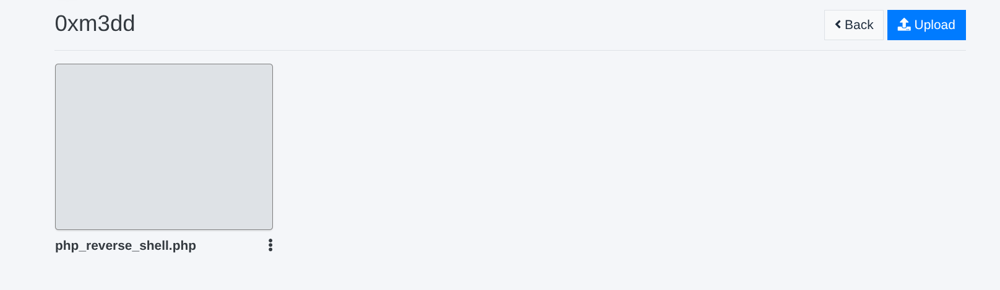

3. **Listener Setup:** I started a Netcat listener on port 1337 to catch the connection.

```bash
nc -lnvp 1337
```
4. **Execution:** I clicked on the uploaded file icon in the dashboard to execute the script on the server.

### Initial Access:

I successfully established a reverse shell connection as the *www-data* user.

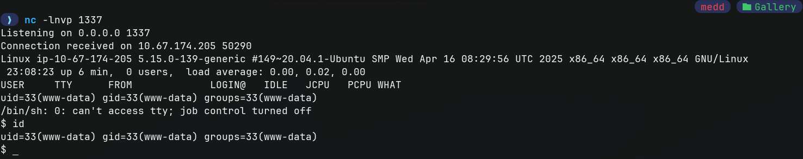

### Shell Stabilization

Upon receiving the connection, the shell was limited (non-interactive). I stabilized it using Python to spawn a fully interactive TTY.

```bash
python3 -c 'import pty;pty.spawn("/bin/bash")'
export TERM=xterm
# (Ctrl+Z to background)
stty raw -echo; fg
```
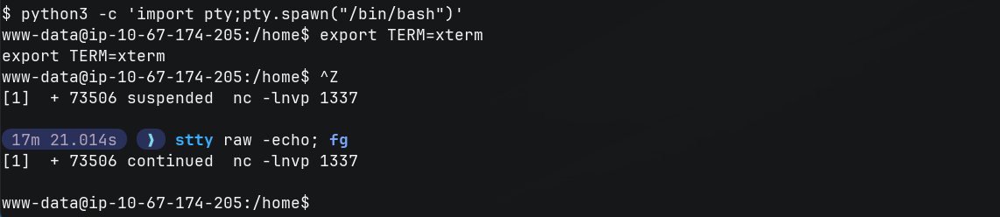

## 4. Lateral Movement (Mike)

After gaining initial access as www-data, I spent a significant amount of time manually exploring the file system. I checked standard locations like /home, /var/www, and /opt but hit several dead ends. The room hint "Mike's mistake" suggested a human error, so I expanded my search to look for backup files or hidden history.

:::tip

In a real engagement, running an automated enumeration script like LinPEAS (./linpeas.sh) is highly recommended at this stage. It would likely have flagged the /var/backups directory or the readable .bash_history file immediately, saving time on manual searching.

:::

### Discovery: The Backup Directory

My persistence paid off when I investigated the /var/backups/ directory. I discovered a non-standard folder named mike_home_backup.

```bash
ls -al /var/backups/
```

Inside this directory, I found a .bash_history file that was readable by my current user (www-data).


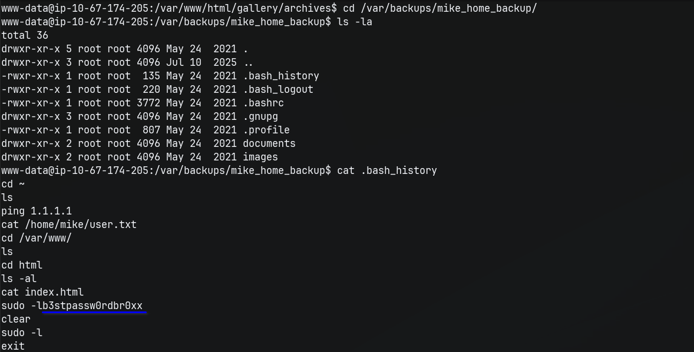

The history revealed the critical mistake: the user accidentally typed their password directly into the command line while trying to run sudo -l.

**Credential Found: `b3stpassw0rdbr0xx`**


### Switching Users

I used this leaked password to switch to the mike user.


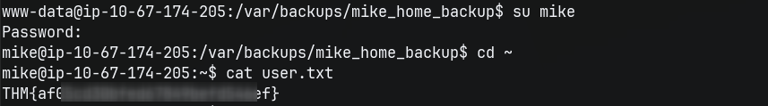

Now authenticated as Mike, I retrieved the user flag.

> **Answer 4**
>
>> What's the user flag?
>
>> `THM{REDACTED}`


# Task 2: Escalate to the root user

## 1. Privilege Escalation Enumeration

After gaining access as mike, I checked for sudo privileges to identify potential escalation vectors.

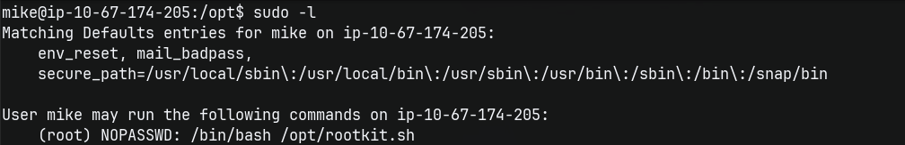

The output confirmed that mike can run a custom script as root without a password.

I inspected the content of this script to understand its functionality.

```bash
cat /opt/rootkit.sh
```

```bash
#!/bin/bash

read -e -p "Would you like to versioncheck, update, list or read the report ? " ans;


# Execute your choice

case $ans in

    versioncheck)

        /usr/bin/rkhunter --versioncheck ;;

    update)

        /usr/bin/rkhunter --update;;

    list)

        /usr/bin/rkhunter --list;;

    read)

        /bin/nano /root/report.txt;;

    *)
esac
```

The script presents a menu to the user. The read option executes /bin/nano on /root/report.txt with root privileges. Since nano allows for command execution, this can be exploited to spawn a root shell (a known GTFOBins technique).

## 2. The Path to Root (GTFOBins: Nano)

I executed the script with sudo and selected the read option to launch nano as root.

```bash
sudo /bin/bash /opt/rootkit.sh
# Input: read
```
Inside the editor, I used the following key sequence to escape the restricted environment and spawn a shell:

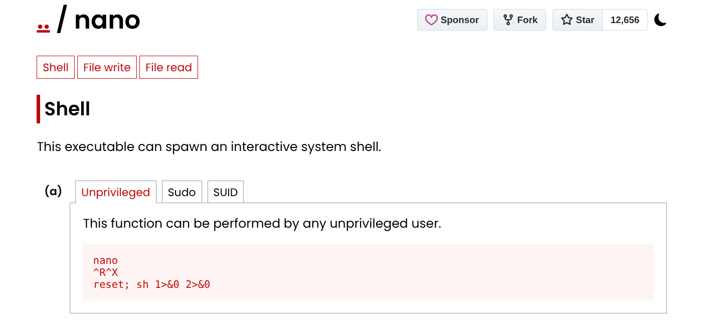

1. Press Ctrl + R (Read File).

2. Press Ctrl + X (Execute Command).

3. Type the command: reset; sh 1>&0 2>&0

4. Press Enter.

This spawned a shell with root privileges.

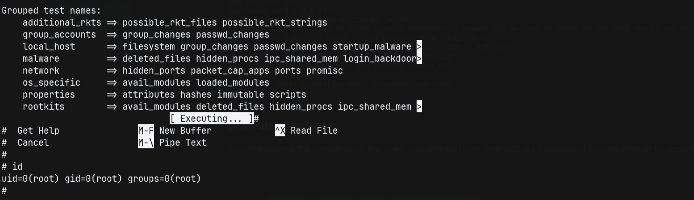

## 3. Retrieving Root Flag

Successfully escalated to root, I navigated to the root directory and captured the final flag.

```bash
cat /root/root.txt

#THM{REDACTED}
```

> **Answer 5**
>
>> What's the root flag?
>
>> `THM{REDACTED}`

# Conclusion

This room demonstrated a classic web-to-root attack chain. I leveraged SQL Injection to extract credentials and File Upload RCE to gain initial access. Finally, I escalated privileges by uncovering a password leak in .bash_history and exploiting a misconfigured Sudo permission on nano to gain root.

**Thanks for following the journey to Root :)**
