**Room Link : https://tryhackme.com/room/operationslitherIU**

# Introduction

Welcome to my writeup for **Operation Slither**. This room puts us in the shoes of a digital investigator tracking down a cybercriminal group known as "Sneaky Viper." The group has infiltrated "TryTelecomMe" and exfiltrated sensitive data. 

Our mission is to follow the digital trail, starting from a single forum post, to identify the leader, uncover their methods, and retrieve the stolen flags.

Let's dive in!

# Task 1: The Leader

## Reconnaissance

The investigation began with a lead from a hacker forum. A user going by the handle **@v3n0mbyt3_** claimed responsibility for the breach and announced that they would be releasing more data soon.

**Initial Intel:**
* **Target Handle:** `@v3n0mbyt3_`
* **Group Name:** Sneaky Viper
* **Platform:** Hacker Forum

To build a profile on this threat actor, I performed a username search across major social media platforms to find where else they might be active.

## Social Media Analysis

While the prompt mentioned Twitter/X, I needed to find a *different* platform. A search for the handle `v3n0mbyt3_` led me to a valid profile on **Threads**.

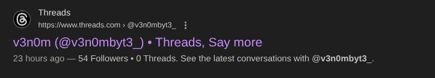

> **Answer 1**
>
>> Aside from Twitter / X, what other platform is used by v3n0mbyt3_? Answer in lowercase.
>
>> `threads`

## Decrypting the Communication

I analyzed the target's activity on Threads, looking for leaks or hidden communications. In the **Replies** tab, I found a suspicious interaction where `@v3n0mbyt3_` responded to another user with a long, random string of characters.

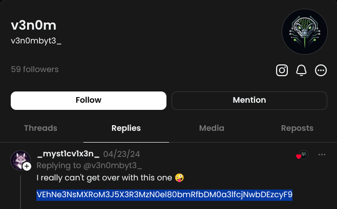
**The Ciphertext:**
`VEhNe3NsMXRoM3J5X3R3MzN0el80bmRfbDM0a3lfcjNwbDEzcyF9`

Observing the string I identified this as likely **Base64** encoded text. I used my terminal to decode it.

```bash
echo -e 'VEhNe3NsMXRoM3J5X3R3MzN0el80bmRfbDM0a3lfcjNwbDEzcyF9' | base64 -d
```
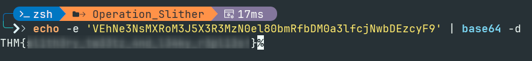	
This revealed the first flag hidden in plain sight.

> **Answer 2**
>
>> What is the value of the flag?
>
>> `THM{REDACTED}`

# Task 2: The Sidekick

## Connecting the Dots

After identifying the leader, the investigation shifted to finding their accomplice. The forum post mentioned a second operator, but the handle was hidden.

Returning to the Threads conversation where I found the first flag, I examined who `@v3n0mbyt3_` was interacting with. The encoded flag was actually a reply to another user: **`_myst1cv1x3n_`**.

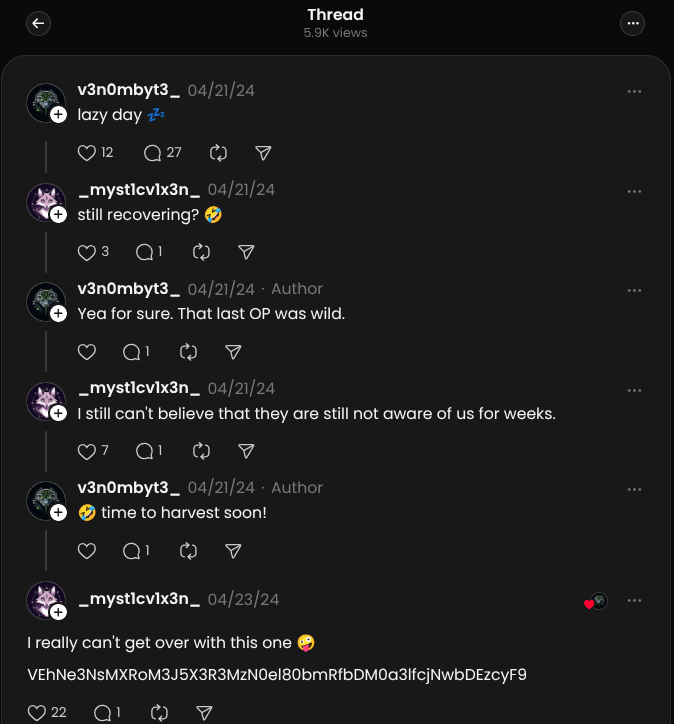

This identifies the second operator.

> **Answer 1**
>
>> What is the username of the second operator talking to v3n0mbyt3 from the previous platform?
>
>> `_myst1cv1x3n_`

## Hunting the Flag (The Pivot)

Armed with the handle `_myst1cv1x3n_`, I searched for their presence on other platforms. I discovered an **Instagram** profile where the user mentioned they had "Been playing with EDM for a while now" and provided a link to a prototype.

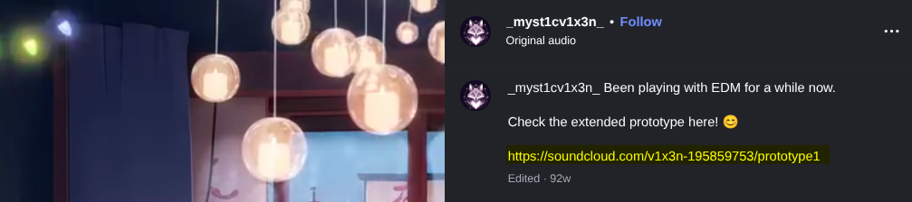

The link directed me to a **SoundCloud** profile for a user named `v1x3n_`.

## Audio Intelligence

I explored the tracks on the SoundCloud profile. While checking the description of the track **"Prototype2"**, I found a suspicious Base64 string hidden in the comments.

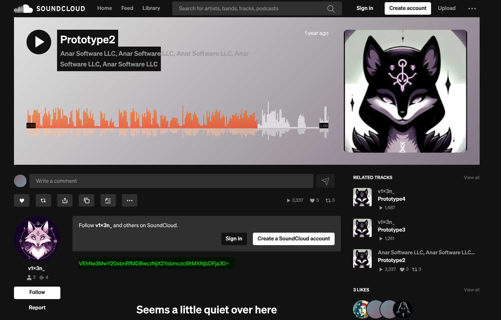

**Ciphertext:**
`VEhNe3MwY20xbnRfMDBwcZNjX2Yxbmczcl9tMXNjbDFja30=`

## Decoding

I used CyberChef to decode the string :

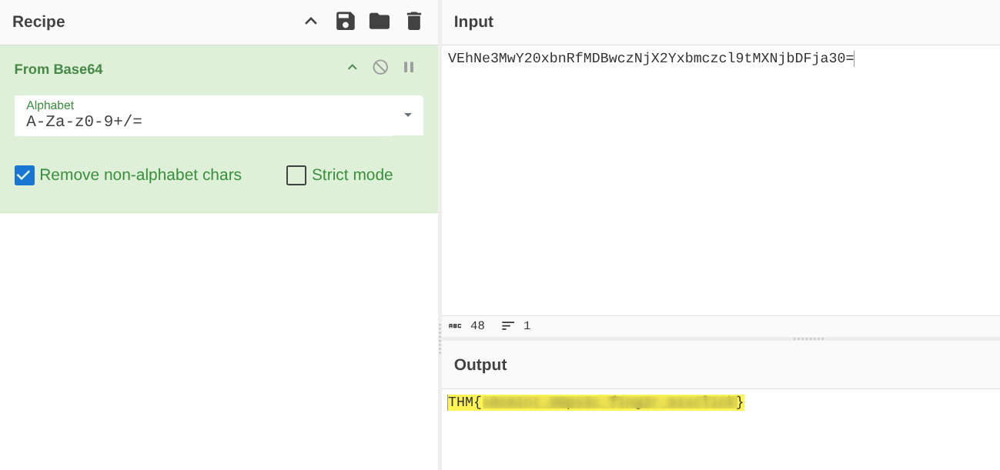

> **Answer 2**
>
>> What is the value of the flag?
>
>> `THM{REDACTED}`


# Task 3: The Last Operator

## Mapping the Network

The investigation led me to the SoundCloud profile of the second operator (`v1x3n_`). To identify the third member of the "Sneaky Viper" group, I checked the **Followers** list on that profile.

One account stood out: **`sh4d0wF4NG`**.

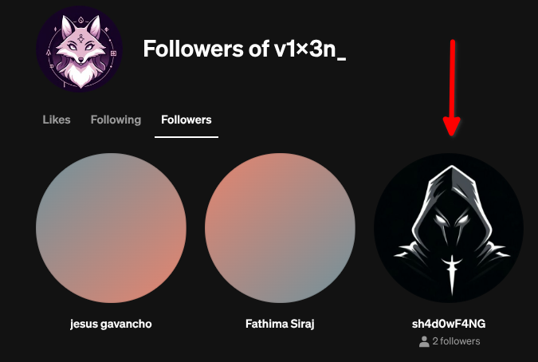

Checking this user's profile, I saw the bio "EDM / LOFI chill," which matched the interests of the group we observed earlier.

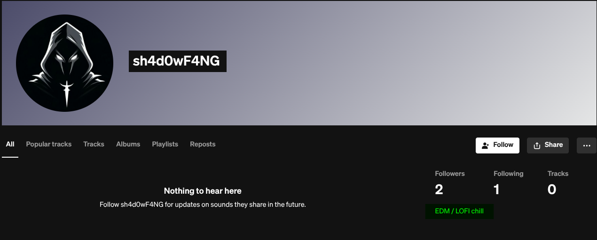

> **Answer 1**
>
>> What is the handle of the third operator?
>
>> `sh4d0wF4NG`

## Pivoting to Development

With the new handle `sh4d0wF4NG`, I searched for the user on other platforms. Given the technical nature of the attacks (scripts, infrastructure), I suspected they might use a code repository.

I successfully located the user on **GitHub**.

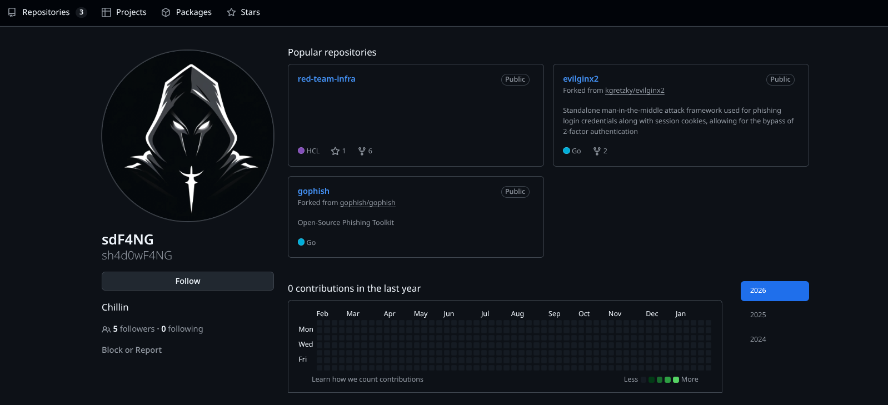

> **Answer 2**
>
>> What other platform does the third operator use? Answer in lowercase.
>
>> `github`

## Secrets in the Commit History

I analyzed the user's repositories. The `red-team-infra` repository immediately caught my eye as it matched the "Inclusions" list from the forum post (Terraform scripts for phishing infrastructure).

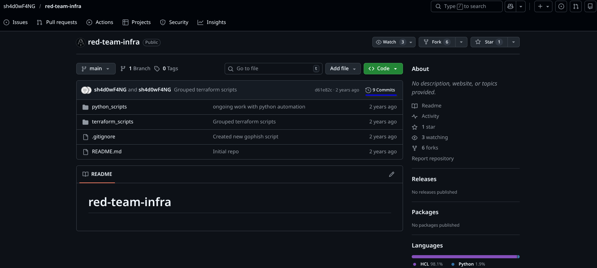

I dove into the **Commit History** to see if any sensitive data had been accidentally committed and then removed. I noticed a commit involving the `terraform.tfstate` file. State files often contain sensitive outputs in plaintext.

Reviewing the diff for that file, I found a `shadow-password` output containing a Base64 string.

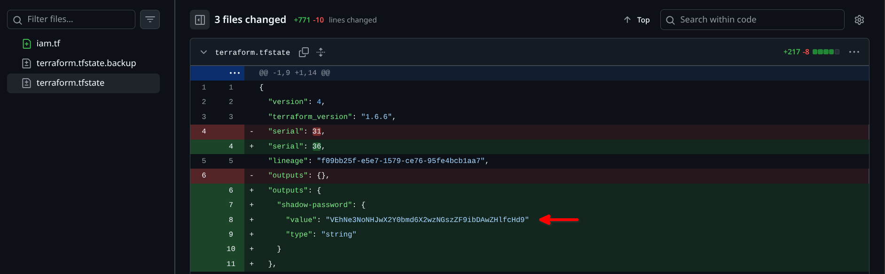

**Ciphertext:**
`VEhNe3NoNHJwX2Y0bmd6X2wzNGszZF9ibTB0ZHlfcHd9`

## Final Decryption

I decoded the string to reveal the final flag.

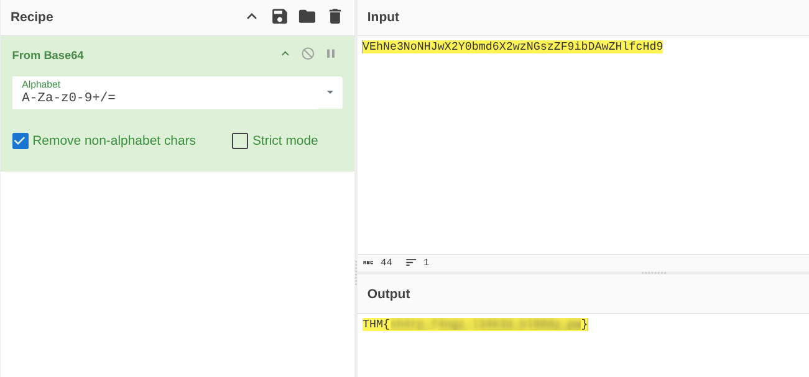

> **Answer 3**
>
>> What is the value of the flag?
>
>> `THM{REDACTED}`

---

# Conclusion

**Operation Slither** was an excellent exercise in digital footprinting and open-source intelligence. We started with a single forum handle and unraveled an entire criminal network by following the connections between their social media profiles.

**Key Takeaways:**
* **Cross-Platform Pivoting:** Usernames are often reused or linked across platforms (Threads -> Instagram -> SoundCloud -> GitHub).
* **Network Mapping:** Checking "Followers" and "Following" lists is a powerful way to find associates.
* **Git Forensics:** Developers frequently leak secrets in commit history.

Thanks for reading :)

You can check out more of my write-ups at [0xm3dd.github.io](https://0xm3dd.github.io).

